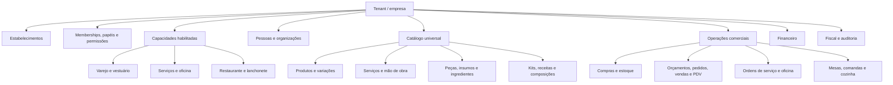
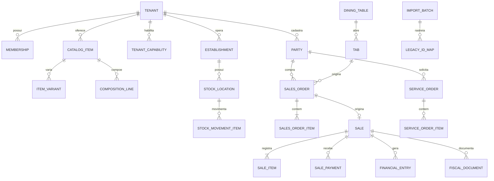
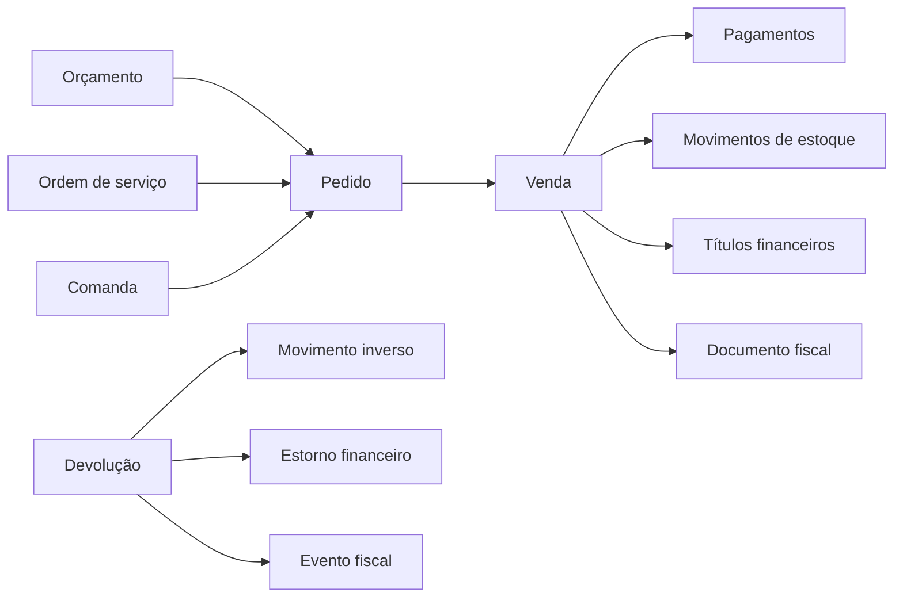

# ConnectionCyber — Arquitetura Canônica Multissegmento

**Módulo:** M01

**Ambiente:** staging

**Data:** 18/08/2026

**Versão:** 1.0.1

**Produção alterada:** não

**Schema aplicado:** não — a implementação física será o portão M02

## 1. Decisão arquitetural

A ConnectionCyber terá um ERP novo, multiempresa e independente da estrutura dos sistemas legados. Segmentos comerciais não serão codificados como versões separadas do produto. Papelaria, vestuário, artesanato, oficina, restaurante, lanchonete e prestação de serviços utilizarão o mesmo núcleo canônico, com capacidades ativáveis e extensões específicas quando necessárias.

Backups antigos serão tratados posteriormente como fontes de migração. Eles não definirão os nomes, relacionamentos ou limites do nosso modelo. A transformação seguirá o sentido `legado → adaptador → modelo ConnectionCyber`, nunca o sentido inverso.

## 2. Objetivos do M01

- definir um núcleo que atenda empresas de segmentos diferentes sem forks por cliente;
- separar capacidades ERP dos serviços comerciais já existentes no `module_catalog`;
- impedir colisão com as tabelas do site e Mercado Pago;
- definir fronteiras, invariantes e catálogo lógico antes de criar migrations;
- permitir que um tenant opere um ou vários segmentos simultaneamente;
- preparar M02 com critérios testáveis de isolamento, auditoria e reversibilidade;
- deixar a engenharia reversa e o povoamento real para uma etapa posterior.

## 3. Princípios obrigatórios

1. **Núcleo universal, extensões por capacidade:** diferenças de segmento são configurações e módulos, não cópias do sistema.
2. **Tenant como fronteira de segurança:** toda entidade de negócio possui `tenant_id` obrigatório e imutável.
3. **Estabelecimento como fronteira operacional:** estoque, caixa, numeração, emissão e calendário podem variar por estabelecimento.
4. **Usuário pode participar de mais de um tenant:** acesso será modelado por associação/membership, sem depender apenas de `users.tenant_id`.
5. **Catálogo polimórfico controlado:** um item pode ser produto, serviço, peça, ingrediente, preparado, kit, insumo, taxa ou vale, sem EAV indiscriminado.
6. **Transações preservam o passado:** vendas, compras e documentos guardam snapshots de descrição, preço, imposto e unidade.
7. **Livros razão são imutáveis:** estoque, caixa, financeiro e fiscal são corrigidos por estorno/contrapartida, não por exclusão destrutiva.
8. **JSONB somente para extensões:** relações, saldos, estados e regras críticas permanecem tipados e relacionais.
9. **Fiscal separado da autenticação:** certificado A1 é uma credencial fiscal; nunca será identidade de usuário.
10. **Migração idempotente:** todo dado legado terá origem, lote, ID anterior, resultado e reconciliação rastreáveis.

## 4. Relação com a plataforma existente

### Reutilizar

- `tenants` como raiz de cada empresa contratante;
- Supabase Auth como provedor de identidade;
- RLS, `current_tenant_id()` e o conceito de equipe da plataforma como base a evoluir;
- `tenant_themes` para identidade visual;
- monorepo, branch staging, CI e Vercel Preview.

### Evoluir de forma aditiva

- criar memberships para usuários que operam múltiplas empresas;
- criar catálogo de capacidades ERP separado do catálogo comercial;
- criar estabelecimentos, configurações tipadas, sequências e auditoria ERP;
- criar tabelas prefixadas com `erp_` no schema `public` durante a primeira fase;
- exigir RLS e FKs que também garantam igualdade de `tenant_id`.

### Não reutilizar como ERP

- `products`, `orders`, `order_items` e `payments`, pois pertencem ao site/Mercado Pago;
- `mpi_products`, pois representa diagnóstico e posicionamento de mercado;
- `module_catalog`, pois atualmente representa serviços contratados da ConnectionCyber;
- `remote_configs` e `remote_automations`, enquanto não forem remodeladas e protegidas.

## 5. Visão funcional

## 6. Modelo de tenant, segmento e capacidades

O campo atual `tenants.vertical` continuará apenas como informação descritiva durante a transição. Ele não será fonte de autorização nem decidirá sozinho quais telas, regras ou tabelas um cliente pode usar.

### Conceitos

| Conceito | Finalidade | Regra |
|---|---|---|
| Tenant | Empresa contratante e fronteira de segurança | Um banco compartilhado, dados isolados por RLS |
| Estabelecimento | Loja, filial, oficina, cozinha ou unidade operacional | Pertence a um tenant; pode ter estoque, caixa e numeração próprios |
| Segment profile | Modelo de configuração inicial | Sugere capacidades; não concede acesso diretamente |
| Capability | Funcionalidade técnica pequena e combinável | Ex.: estoque, variações, oficina, comandas, fiscal |
| Tenant capability | Capacidade efetivamente habilitada | Possui estado, vigência, limites e configuração |
| Membership | Associação entre usuário e tenant | Determina a quais empresas o usuário pode acessar |
| Role/permission | O que o usuário pode fazer naquela empresa | Sempre avaliado dentro da membership ativa |

### Tabelas de fundação propostas para M02

| Tabela | Responsabilidade | Observação de segurança |
|---|---|---|
| `erp_tenant_memberships` | associa usuário, tenant, situação e período | unicidade por usuário/tenant; acesso ativo obrigatório |
| `erp_roles` | papéis configuráveis do ERP | papéis globais e do tenant separados |
| `erp_permissions` | catálogo de ações autorizáveis | chaves estáveis, como `inventory.adjust` |
| `erp_membership_roles` | papéis de uma membership | FK composta impedindo cruzamento de tenant |
| `erp_establishments` | filiais/unidades operacionais | CNPJ e parâmetros por estabelecimento |
| `erp_capability_catalog` | catálogo técnico de capacidades | leitura autenticada; escrita apenas administrativa |
| `erp_tenant_capabilities` | capacidades habilitadas por tenant | estado, vigência e limites auditados |
| `erp_segment_profiles` | perfis reutilizáveis de segmento | modelo, nunca autorização |
| `erp_segment_profile_capabilities` | composição dos perfis | sem dados de cliente |
| `erp_tenant_settings` | configurações tipadas por tenant | segredos proibidos; valores validados no servidor |
| `erp_number_sequences` | numeração transacional | escopo por tenant/estabelecimento/tipo |
| `erp_audit_events` | trilha imutável de ações | ator, tenant, estabelecimento, objeto e resultado |

## 7. Catálogo lógico canônico

Os nomes abaixo são contratos de arquitetura. Nenhuma tabela será criada no M01.

| Domínio | Entidades propostas | Finalidade | Fase |
|---|---|---|---:|
| Fundação | `erp_tenant_memberships`, `erp_roles`, `erp_permissions`, `erp_membership_roles` | identidade operacional e autorização | M02/M04 |
| Organização | `erp_establishments`, `erp_cost_centers`, `erp_sales_channels` | unidades, centros e canais | M02 |
| Capacidades | `erp_capability_catalog`, `erp_tenant_capabilities`, `erp_segment_profiles` | composição multissegmento | M02 |
| Pessoas | `erp_parties`, `erp_party_roles`, `erp_party_documents`, `erp_party_contacts`, `erp_party_addresses` | pessoa física/jurídica sem duplicação | M05 |
| Equipe | `erp_employees`, `erp_sales_reps`, `erp_technicians` | vínculos operacionais | M05/M09 |
| Catálogo | `erp_catalog_items`, `erp_item_variants`, `erp_item_identifiers` | produtos, serviços, peças e ingredientes | M05 |
| Atributos | `erp_attributes`, `erp_attribute_values`, `erp_item_attribute_values` | cor, tamanho, material e propriedades controladas | M05 |
| Unidades | `erp_units`, `erp_unit_conversions` | unidade, caixa, quilo, metro e conversões | M05 |
| Composição | `erp_item_compositions`, `erp_item_composition_lines` | kits, receitas, fichas técnicas e conjuntos | M05/M10 |
| Preços | `erp_price_lists`, `erp_price_items`, `erp_promotions` | preços por canal, vigência e condições | M06 |
| Estoque | `erp_stock_locations`, `erp_stock_lots`, `erp_stock_serials`, `erp_stock_movements`, `erp_stock_movement_items`, `erp_stock_reservations` | livro razão, lotes, séries e reservas | M06 |
| Inventário | `erp_inventory_counts`, `erp_inventory_count_items` | conferência e ajuste rastreável | M06 |
| Compras | `erp_purchase_orders`, `erp_purchase_order_items`, `erp_goods_receipts`, `erp_goods_receipt_items` | pedido e recebimento | M06 |
| Comercial | `erp_quotes`, `erp_quote_items`, `erp_sales_orders`, `erp_sales_order_items`, `erp_sales`, `erp_sale_items`, `erp_returns` | orçamento, pedido, venda e devolução | M07 |
| Pagamentos/PDV | `erp_payment_methods`, `erp_sale_payments`, `erp_cash_registers`, `erp_cash_sessions`, `erp_cash_movements` | recebimentos e caixa | M07 |
| Financeiro | `erp_financial_accounts`, `erp_financial_entries`, `erp_installments`, `erp_settlements`, `erp_bank_accounts`, `erp_bank_reconciliations` | receber, pagar, tesouraria e bancos | M08 |
| Serviços/oficina | `erp_assets`, `erp_vehicles`, `erp_service_orders`, `erp_service_order_items`, `erp_service_order_events`, `erp_appointments` | equipamentos, veículos, mão de obra e OS | M09 |
| Alimentação | `erp_dining_areas`, `erp_dining_tables`, `erp_tabs`, `erp_item_modifiers`, `erp_kitchen_orders`, `erp_kitchen_order_items` | salão, comandas, adicionais e cozinha | M10 |
| Atendimento | `erp_tickets`, `erp_ticket_events`, `erp_slas` | suporte e histórico | M11 |
| Acesso remoto | `erp_managed_devices`, `erp_support_consents`, `erp_remote_sessions` | dispositivo, consentimento e auditoria | M11 |
| Fiscal | `erp_tax_profiles`, `erp_fiscal_documents`, `erp_fiscal_document_items`, `erp_fiscal_events`, `erp_certificate_refs` | NF-e/NFC-e e referências protegidas de A1 | M13 |
| Migração | `erp_import_batches`, `erp_legacy_id_map`, `erp_import_errors`, `erp_reconciliation_results` | carga idempotente e reconciliação | M14 |

## 8. Catálogo universal de itens

`erp_catalog_items.kind` deverá aceitar tipos controlados, extensíveis por migration revisada:

- `product`: bem físico vendido ou consumido;
- `service`: serviço ou mão de obra;
- `part`: peça utilizada em manutenção;
- `ingredient`: insumo de receita/preparo;
- `prepared`: item produzido ou preparado;
- `kit`: conjunto comercial de outros itens;
- `supply`: material de consumo interno;
- `fee`: taxa ou adicional não estocável;
- `voucher`: crédito/vale com regras próprias.

### Exemplos usando o mesmo núcleo

| Segmento | Item | Representação |
|---|---|---|
| Papelaria | caderno universitário | `product`, variação opcional, unidade `UN` |
| Vestuário | camiseta feminina azul M | `product` + variante cor/tamanho |
| Artesanato | tecido vendido por metro | `product`, unidade `M`, quantidade fracionada |
| Oficina | filtro de óleo | `part`, estoque e aplicação em OS |
| Oficina | troca de óleo | `service`, tempo/mão de obra, sem estoque próprio |
| Restaurante | hambúrguer | `prepared` + composição de ingredientes |
| Lanchonete | adicional de queijo | `ingredient`/modificador conforme política |
| Serviços | manutenção mensal | `service`, recorrência tratada no contrato/financeiro |

## 9. Matriz de capacidades por segmento

Legenda: **Base** obrigatória; **Ativa** sugerida pelo perfil; **Opcional** habilitada conforme contrato; **—** normalmente desnecessária.

| Capacidade | Varejo geral | Vestuário/papelaria | Oficina | Restaurante/lanchonete | Prestação de serviços |
|---|---|---|---|---|---|
| Tenant, estabelecimento, usuários e auditoria | Base | Base | Base | Base | Base |
| Pessoas, clientes e fornecedores | Base | Base | Base | Base | Base |
| Catálogo e preços | Base | Base | Base | Base | Base |
| Variações e atributos | Opcional | Ativa | Opcional | Opcional | — |
| Estoque e compras | Ativa | Ativa | Ativa | Ativa | Opcional |
| Lotes e validade | Opcional | Opcional | Opcional | Ativa | — |
| Número de série | Opcional | — | Opcional | — | Opcional |
| Orçamento, pedido e venda | Ativa | Ativa | Ativa | Ativa | Ativa |
| PDV e caixa | Ativa | Ativa | Opcional | Ativa | Opcional |
| Ordens de serviço | Opcional | — | Ativa | — | Ativa |
| Veículos e equipamentos | — | — | Ativa | — | Opcional |
| Receitas e composição | Opcional | Opcional | Opcional | Ativa | — |
| Mesas, comandas e cozinha | — | — | — | Ativa | — |
| Financeiro | Base | Base | Base | Base | Base |
| Fiscal | Ativa | Ativa | Ativa | Ativa | Conforme atividade |
| Atendimento e acesso remoto | Opcional | Opcional | Opcional | Opcional | Opcional |

Um tenant poderá combinar perfis. Uma loja que venda roupas e também faça ajustes poderá habilitar varejo, variações e ordens de serviço sem receber uma versão própria do sistema.

## 10. Relações lógicas principais

O diagrama é conceitual. Nomes finais, colunas e cardinalidades completas serão consolidados nas migrations do M02 e de cada módulo.

## 11. Invariantes técnicas e contábeis

### Tenancy e autorização

- `tenant_id` nunca será aceito como autoridade vindo do navegador;
- o servidor resolverá tenant e membership a partir da sessão e do contexto ativo autorizado;
- relações entre tabelas de negócio usarão chave/constraint que impeça referenciar linha de outro tenant;
- equipe ConnectionCyber terá acesso cross-tenant apenas por ação administrativa explícita e auditada;
- capacidades habilitam funções, mas permissões determinam ações do usuário.

### Valores, quantidades e tempo

- dinheiro: `numeric(19,4)`; arredondamento definido por operação e moeda;
- quantidade: `numeric(19,6)` para peso, metragem e conversões;
- timestamps armazenados em UTC; data operacional calculada pelo fuso do estabelecimento;
- documentos guardam moeda, unidade, descrição, preço, descontos e impostos como snapshot;
- CPF/CNPJ, códigos fiscais e identificadores passam por normalização e validação no servidor.

### Estoque, financeiro e fiscal

- saldo de estoque é projeção do livro de movimentos; não é editado sem movimento de ajuste;
- baixa/entrada deve indicar origem, ator, estabelecimento, localização e idempotency key;
- títulos e liquidações mantêm histórico; correções usam estorno ou lançamento compensatório;
- documentos fiscais autorizados e seus eventos são imutáveis;
- PFX e senha A1 ficam em cofre/serviço protegido; `erp_certificate_refs` guarda somente referência e metadados seguros.

### Extensibilidade e dados

- JSONB não substituirá FKs, itens, parcelas, movimentos ou estados;
- atributos flexíveis serão permitidos apenas no catálogo e em configurações com schema validado;
- exclusão lógica será usada em cadastros; transações escrituradas não serão apagadas;
- todas as tabelas transacionais terão `created_at`, ator e, quando aplicável, `updated_at`, versão e idempotency key.

## 12. Estados e fluxos

Cada transição será comandada por serviço de domínio e executada transacionalmente. Interfaces não poderão alterar status diretamente sem validar a máquina de estados.

## 13. Migração futura do legado

A análise anterior de engenharia reversa foi preservada como estudo de migração, mas não bloqueia M02. No M14, o processo será:

1. preservar original e gerar cópia/hash;
2. restaurar em laboratório isolado;
3. extrair dicionário físico e contagens;
4. criar adaptador específico da origem;
5. transformar para contratos canônicos versionados;
6. carregar via `erp_import_batches` e `erp_legacy_id_map`;
7. reconciliar por tenant, entidade, período e valor;
8. repetir sem duplicidade;
9. obter aceite antes do corte.

## 14. Portões determinísticos do M01

| Portão | Entrega | Critério | Estado |
|---|---|---|---|
| M01-A | Decisão núcleo vs. legado | backup não dirige o modelo | Aprovado pelo responsável |
| M01-B | Fronteiras e reaproveitamento | tabelas atuais classificadas em reutilizar/evoluir/não reutilizar | Concluído |
| M01-C | Núcleo e catálogo lógico | domínios, entidades e responsabilidades documentados | Concluído |
| M01-D | Segmentos e capacidades | varejo, vestuário/papelaria, oficina, alimentação e serviços cobertos | Concluído |
| M01-E | Invariantes | tenancy, auditoria, valores, estoque, financeiro e fiscal definidos | Concluído |
| M01-F | Contrato do M02 | escopo físico inicial e testes de aceite definidos | Concluído |
| M01-G | Validação remota | commit, CI e Preview verdes | Aprovado |

## 15. Contrato de execução do M02

O M02 implementará somente a fundação necessária para sustentar os módulos posteriores:

1. `erp_tenant_memberships` e resolução segura do tenant ativo;
2. `erp_establishments`;
3. `erp_capability_catalog` e `erp_tenant_capabilities`;
4. `erp_segment_profiles` e composição de capacidades;
5. `erp_tenant_settings` sem segredos;
6. `erp_number_sequences` concorrente e transacional;
7. `erp_audit_events` append-only;
8. RLS, grants mínimos, índices e constraints cross-tenant;
9. testes SQL positivos e negativos de isolamento;
10. migrations aditivas com rollback de laboratório/forward-fix documentado.

M02 não incluirá clientes reais, produtos, estoque, vendas, financeiro, fiscal, A1, backup legado ou Mercado Pago.

## 16. Critérios de aceite do M01

- arquitetura cobre os cinco perfis de segmento sem fork de código ou banco;
- um tenant pode combinar capacidades de segmentos diferentes;
- catálogo universal representa produto, serviço, peça, ingrediente, preparado e kit;
- módulos existentes do site foram separados semanticamente do ERP;
- memberships substituem a limitação futura de um usuário/um tenant;
- RLS, FK cross-tenant, auditoria e imutabilidade estão definidos como invariantes;
- legado foi reclassificado como entrada futura de migração;
- escopo do M02 está fechado e não contém dados reais;
- documentos MD/HTML equivalentes, commit, CI e Preview aprovados;
- produção permanece inalterada.

## 17. Próxima ação autorizável

Após M01-G ficar verde, o próximo comando determinístico será:

`M01 aprovado; apresentar migrations e testes do M02 — fundação ERP multiempresa.`

Esse comando autoriza preparar o código e o parecer do M02, mas não aplicar migrations no Supabase até a revisão do SQL, do rollback e dos testes de isolamento.

## 18. Evidências de validação

- checkpoint arquitetural: `1feb493` em `origin/staging`;
- GitHub Actions `Quality gates` `32192279665`: concluído com sucesso;
- Vercel Preview `dpl_DNFfHanCrdhhGUAvQ7LVxJ3HLj5m`: target `preview`, estado `Ready` e alias staging confirmado;
- migrations e aplicações alteradas no M01: nenhuma;
- produção, dados reais, Mercado Pago, fiscal e A1 alterados: não.

---

ConnectionCyber Assessoria e Treinamento — Tecnologia que traz conhecimento e gestão.
