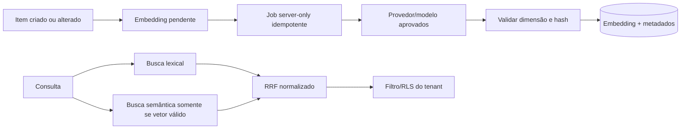

# Auditoria técnica — CTR e busca híbrida 0027

Data: 27/08/2026

## 1. Resultado executivo

**Reprovada para aplicação remota no estado atual.**

A proposta é tecnicamente viável, mas o pacote ainda não atende aos portões determinísticos do projeto. A migration não possui preflight, rollback, testes pgTAP, auditoria de resíduos nem contrato de geração de embeddings. As alterações Next.js gravam o mesmo vetor fictício em todos os itens, tornando a busca semântica inválida.

Nenhum arquivo CTR foi alterado durante esta auditoria.

## 2. Escopo analisado

- `supabase/migrations/0027_m05_ctr_hybrid_search.sql`;
- `apps/platform/src/features/catalog/actions.ts`;
- `apps/platform/src/features/catalog/service.ts`;
- `.docs/01-standards/STANDARD_CTR_ARCHITECTURE.md`;
- `.docs/03-specs/SPEC_M05_CATALOGO_CTR.md`;
- schema, RLS e permissões já aplicados no catálogo M05.

## 3. Achados críticos

### C-01 — embedding fictício e idêntico

`new Array(1536).fill(0.01)` é gravado em todos os itens. Isso produz vetores semanticamente indistinguíveis, polui o índice HNSW e pode retornar resultados enganosos. O `semanticContext` é construído, mas nunca vetorizado.

**Correção obrigatória:** remover o placeholder. Enquanto não existir provedor real, gravar `NULL` e usar somente busca lexical. Embeddings reais devem ser gerados server-side, com modelo/dimensão fixados e validação de comprimento.

### C-02 — extensão e operadores sem schema determinístico

`CREATE EXTENSION vector`, o tipo `vector(1536)`, `vector_cosine_ops` e o operador `<=>` dependem do schema em que a extensão estiver instalada. A função usa `search_path=''`, mas não qualifica tipo, operator class ou operador.

**Correção obrigatória:** preflight deve descobrir/validar o schema esperado da extensão. A migration deve qualificar os objetos de `pgvector` de forma compatível com o Supabase staging e recusar configuração divergente.

### C-03 — pacote sem portões de segurança

Não existem preflight, rollback protegido, testes pgTAP, dry-run documentado ou consulta de zero resíduos. Isso impede aplicação determinística e recuperação segura.

**Correção obrigatória:** entregar pacote completo antes de qualquer `db push`.

### C-04 — RPC sem limites de entrada e custo

`match_count` aceita valor negativo, zero ou excessivo; `query_text` e `query_embedding` não possuem validação explícita. `match_count * 2` pode ampliar custo e abuso.

**Correção obrigatória:** limitar `match_count`, validar texto, vetor, finitude e dimensão; aplicar timeout e rate limit na camada server-side.

### C-05 — escrita de embedding pelo cliente autenticado

O fluxo atual adiciona `embedding` ao insert comum do catálogo. Um usuário com escrita no catálogo pode fornecer vetor arbitrário, sem proveniência ou validação do modelo.

**Correção obrigatória:** manter embedding fora do payload do formulário. Atualização vetorial deve ocorrer por workflow server-only/RPC restrita, nunca pelo navegador.

## 4. Achados altos

### A-01 — isolamento depende implicitamente da RLS

`SECURITY INVOKER` é uma boa base, mas a RPC aceita `p_tenant_id` informado pelo chamador e não verifica explicitamente `catalog.read`. Usuários comuns continuam limitados pela RLS atual; equipe de plataforma pode consultar qualquer tenant autorizado pela policy ampla, sem motivo específico registrado.

**Correção:** validar `erp_security.has_permission(p_tenant_id,'catalog.read')` ou fluxo administrativo auditado, mantendo RLS como segunda barreira.

### A-02 — ranking não normalizado

Similaridade de cosseno e `ts_rank` têm escalas diferentes. O peso fixo `1.5` não normaliza os sinais e pode gerar ordenação instável. O documento chama a busca lexical de BM25, mas PostgreSQL `ts_rank` não é BM25.

**Correção:** usar Reciprocal Rank Fusion ou normalização documentada e testada; corrigir a nomenclatura técnica.

### A-03 — HNSW e filtro por tenant

O índice global busca vizinhos antes/depois do filtro conforme o plano e pode retornar menos resultados em tenants pequenos ou concorridos. O índice também inclui linhas com embedding nulo.

**Correção:** índice parcial `WHERE embedding IS NOT NULL`, testes com múltiplos tenants e análise de `EXPLAIN`; avaliar iterative scans/particionamento somente com evidência de volume.

### A-04 — ausência de proveniência e reprocessamento

Não há colunas ou ledger para modelo, dimensão, versão do contexto, hash do conteúdo, status, erro ou horário da geração. Mudança de nome/descrição deixa o vetor obsoleto.

**Correção:** criar metadados de embedding e fila idempotente de reprocessamento; atualização do item apenas marca o vetor como pendente.

### A-05 — dependência de provedor indefinida

O padrão menciona Anthropic para contextualização, a spec cita OpenAI `text-embedding-3-small`, e a aplicação possui dependência Google GenAI. Não existe decisão aprovada sobre provedor, modelo, dimensão, custo, retenção ou envio de dados.

**Correção:** aprovar contrato do provedor antes de transmitir qualquer conteúdo de cliente.

## 5. Achados médios

- FTS usa configuração fixa `portuguese`; deve haver estratégia para códigos, siglas e conteúdo multilíngue;
- não há tratamento explícito para embeddings nulos na busca semântica;
- nomes de índices globais não incluem versão do modelo/dimensão;
- criação HNSW pode ser pesada em tabela populada e precisa de janela/timeout;
- a interface ainda não implementa consulta, estados de carregamento ou fallback lexical;
- comentários prometem “precisão absoluta”, requisito impossível e inadequado para aceite;
- não há métricas de qualidade como precision@k, recall@k, MRR ou conjunto de avaliação.

## 6. Pontos aprovados

- uso de `SECURITY INVOKER` preserva a RLS como barreira de segurança;
- FTS gerado e índice GIN são adequados como base lexical;
- HNSW é tecnicamente compatível com busca aproximada quando houver volume e vetores reais;
- tenant aparece no filtro de ambas as buscas;
- execução foi revogada de `anon`;
- busca híbrida é compatível com a arquitetura, após correções.

## 7. Arquitetura corrigida proposta

## 8. Sequência determinística de remediação

1. retirar o vetor placeholder do fluxo de criação e preservar `embedding=NULL`;
2. decidir provedor, modelo, dimensão, privacidade, custo e fallback lexical;
3. reescrever a migration `0027` com schema pgvector explícito, metadados, limites e RRF;
4. criar preflight, rollback, suíte pgTAP e testes multiempresa/qualidade;
5. executar type-check, ESLint e laboratório local descartável;
6. parar antes de qualquer aplicação remota e solicitar autorização exclusiva da `0027`;
7. somente após `0027` aprovada, validar a migration M11 `0028`.

## 9. Critérios mínimos de aceite

- zero vetor fictício;
- nenhum conteúdo enviado a provedor sem contrato aprovado;
- embedding gerado somente no servidor;
- modelo, dimensão, hash e versão rastreáveis;
- fallback lexical quando embedding estiver ausente;
- RLS e permissão explícita por tenant;
- entrada e custo limitados;
- ranking híbrido determinístico e testado;
- preflight, rollback e pgTAP aprovados;
- zero dados reais e produção intocada.
