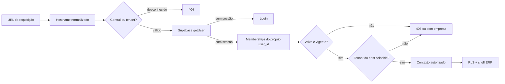

# ConnectionCyber — Pacote técnico M03

## Portal do cliente, subdomínios e isolamento multiempresa

**Ambiente:** `connectioncyber-staging`

**Data:** 18/08/2026

**Versão:** 1.2.0

**Estado:** validado no Supabase staging; aguarda aceite formal do M03

**Produção alterada:** não

## 1. Resultado deste portão

O pacote implementável do M03 foi criado somente na branch `staging`:

- aplicação `apps/portal` em Next.js 15 App Router e TypeScript;
- login e logout com Supabase SSR;
- resolução server-side de hostname;
- seleção de empresa por membership;
- cookie host-only de membership ativa;
- estados 403, 404, sem empresa e serviço indisponível;
- shell ERP somente leitura;
- migration `0017_portal_tenant_resolution.sql`;
- preflight somente leitura;
- rollback exclusivo de laboratório descartável;
- 19 testes unitários e 35 asserções pgTAP;
- job `portal` no Quality Gates.

A migration 0017 foi aplicada exclusivamente no Supabase staging
`ozvylnaipubrmaadikvk`, depois de preflight remoto e dry-run que selecionou somente
esse arquivo. Nenhum projeto Vercel, domínio, DNS, dado real ou produção foi
modificado.

## 2. Fluxo de autorização implementado

O guard não recebe `tenant_id` do navegador. Mesmo no portal central, o cookie
contém somente o UUID opaco da membership e é revalidado contra usuário,
status, vigência e tenant.

## 3. Estrutura da aplicação

| Camada | Arquivos principais | Responsabilidade |
|---|---|---|
| Hostname | `src/domain/hostname.ts` | normalização e classificação exata |
| Decisão | `src/domain/portal-access.ts` | máquina de estados de autorização |
| Redirect | `src/domain/redirect.ts` | allowlist contra open redirect |
| Origem | `src/domain/request-origin.ts` | bloqueio same-origin para formulários POST |
| Sessão | `src/lib/supabase/*` | cookies SSR e `getUser()` |
| Contexto | `src/lib/portal-context.ts` | resolver host, buscar memberships próprias e decidir |
| Middleware | `src/middleware.ts` | renovar sessão, sobrescrever host interno e `no-store` |
| Autenticação | `src/app/auth/*` | login, logout, seleção e limpeza de membership |
| Telas públicas | `login`, `selecionar-empresa`, `403`, `404`, `sem-empresa` | estados explícitos sem fallback cross-tenant |
| Shell | `src/app/(portal)` | navegação ERP somente leitura |

Foram criados 36 arquivos de aplicação/configuração, quatro suítes unitárias e
dez rotas/páginas operacionais. O logo oficial é importado do ativo já existente
em `logo/logosf.png`, sem duplicação.

## 4. Migration 0017 apresentada

### 4.1 `erp_tenant_domains`

| Regra | Implementação |
|---|---|
| hostname canônico | minúsculo, FQDN ASCII, sem porta, caminho, wildcard ou label inválida |
| unicidade | `unique(hostname)` |
| subdomínio ConnectionCyber | somente um label antes de `.connectioncyber.com.br` |
| domínio ativo | exige `verified_at` |
| domínio primário | precisa estar ativo; máximo um por tenant |
| leitura anônima | proibida na tabela |
| leitura autenticada | somente membership ativa do próprio usuário |
| escrita | somente backend privilegiado futuro; sem DML para `authenticated` |

### 4.2 Resolver público mínimo

`portal_resolve_host(text)`:

- aceita somente igualdade após normalização estrita;
- retorna no máximo uma identidade pública mínima;
- ignora domínio pendente, suspenso ou revogado;
- ignora tenant inativo;
- não concede acesso nem retorna membership, usuário ou dados empresariais.

### 4.3 Compatibilidade multiempresa

A migration adiciona `tenants_select_erp_membership`, pois a policy antiga de
`tenants` usa o campo transitório `users.tenant_id`. Sem a nova policy, um
usuário com memberships em várias empresas não conseguiria ler corretamente os
tenants adicionais.

## 5. Testes apresentados

### 5.1 Unitários — executados

Resultado: **19/19 aprovados**.

- hostname central exato;
- domínio candidato e host inválido;
- recusa de wildcard, caminho, IP e labels inválidas;
- localhost somente em desenvolvimento;
- 404 antes do login para host inválido;
- 403 para membership de outro tenant ou usuário;
- memberships suspensa, futura e expirada;
- entrada direta com uma empresa;
- seletor ordenado com várias empresas;
- cookie adulterado ou pertencente a outro usuário;
- allowlist de redirect interno;
- bloqueio same-origin em todos os formulários POST.

### 5.2 pgTAP — executado localmente e no staging

Arquivo: `supabase/tests/0017_portal_tenant_resolution.test.sql`.

Total: **35 asserções**, incluindo:

- tabela, funções, constraints, RLS e policies;
- grants mínimos para `anon` e `authenticated`;
- resolver ativo, desconhecido, pendente, suspenso e tenant inativo;
- usuário A sem leitura de domínio B;
- membership ERP funcionando mesmo com `users.tenant_id` legado divergente;
- staff sem membership sem bypass;
- recusa de DML autenticado, domínio não verificado, hostname não canônico,
  domínio duplicado, primário pendente e segundo primário.

Resultado: **35/35 aprovados em duas passagens locais independentes**, antes e
depois da destruição e reconstrução completa do laboratório, e **35/35 aprovados
no Supabase staging**. A passagem remota ocorreu dentro de transação com rollback;
uma consulta posterior comprovou zero tenants, usuários, memberships, papéis e
domínios sintéticos remanescentes.

## 6. Validações locais e remotas executadas

| Validação | Resultado |
|---|---|
| testes unitários | 19/19 |
| TypeScript | aprovado |
| ESLint | zero warning/erro |
| build Next.js | aprovado; 11 rotas + middleware |
| dependências na geração do lock | zero vulnerabilidades reportadas |
| visual desktop 1440 px | aprovado |
| visual celular 360 px | aprovado |
| overflow horizontal | ausente |
| erros de navegador | zero |
| ambiente sem variáveis | formulário bloqueado e nenhum acesso a banco |
| Quality Gates GitHub | execução 32204837889: site, platform e portal aprovados |
| Preview staging existente | integração Vercel aprovada e HTTP 200 |
| preflight local | `M03_PREFLIGHT_OK` em duas construções PostgreSQL 17.6 |
| dry-run | somente `0017_portal_tenant_resolution.sql`; hash SHA-256 `ac08fb…90c79` |
| primeira suíte pgTAP | 35/35 |
| rollback sem confirmações | bloqueado, objetos preservados |
| rollback com um domínio | bloqueado, dado e objetos preservados |
| rollback confirmado e vazio | aprovado; somente objetos M03 removidos |
| reconstrução completa | novo contêiner, migrations 0001–0017 e nova passagem 35/35 |
| encerramento | contêiner e rede M03 removidos; zero fixtures e resíduos |
| vínculo remoto | projeto staging `ozvylnaipubrmaadikvk` confirmado |
| preflight remoto | `M03_PREFLIGHT_OK`; PostgreSQL 17.6; zero domínios legados |
| dry-run remoto | somente `0017_portal_tenant_resolution.sql`; sem seeds ou roles |
| histórico remoto | migrations 0001–0017 alinhadas |
| estrutura remota | tabela, RLS, 2 policies, 12 constraints, 6 índices e trigger comprovados |
| funções e grants | resolver mínimo, normalizador privado e permissões esperadas comprovados |
| lint remoto | zero erros nos schemas `public` e `erp_security` |
| suíte pgTAP remota | 35/35 dentro de transação com rollback |
| resíduos remotos | zero fixtures e zero linhas em `erp_tenant_domains` |

## 7. Arquivos SQL e política de correção

| Arquivo | Estado |
|---|---|
| `supabase/migrations/0017_portal_tenant_resolution.sql` | aplicada somente no Supabase staging; SHA-256 `ac08fb…90c79` |
| `supabase/preflight/0017_portal_tenant_resolution_preflight.sql` | somente leitura; aprovado localmente e no staging |
| `supabase/tests/0017_portal_tenant_resolution.test.sql` | 35/35 em duas passagens locais e uma remota |
| `supabase/rollback/0017_portal_tenant_resolution.rollback.sql` | bloqueios e liberação local aprovados |

Depois da aplicação remota, o rollback destrutivo permanece proibido. Correções
remotas serão migrations forward-fix com novo número e novo aceite.

## 8. Riscos residuais e próximos controles

| Risco | Estado | Próximo controle |
|---|---|---|
| erro sintático ou comportamento SQL | provado localmente e no staging | manter forward-fix como única política remota |
| migrations históricas criarem fixtures | controlado | dry-run selecionou exclusivamente 0017; zero fixtures remotas |
| variáveis de Preview apontarem para produção | não configuradas | portão próprio antes do projeto Vercel |
| DNS/wildcard afetar site/e-mail | evitado | nenhum DNS neste portão |
| usuário real não existir | esperado | M04 provisionará convites/RBAC/MFA |
| escrita ERP | fora de escopo | módulos M04+ com comandos auditados |

O checkpoint de laboratório `563a669` foi publicado somente na branch `staging`.
O Quality Gate `32204837889` aprovou `site`, `platform` e `portal`. A integração
Vercel já existente atualizou o Preview do site institucional automaticamente;
nenhum projeto do portal, subdomínio, DNS, variável do portal ou banco foi
criado ou reconfigurado.

### 8.1 Ocorrências controladas do laboratório

- A clonagem física inicial do baseline foi recusada por duas sessões internas
  do PostgreSQL. Nenhum objeto foi criado; o dry-run aprovado usou snapshot
  lógico, sem encerrar sessões.
- Um banco vazio de `template0` não possuía o schema Supabase `auth` e foi
  descartado antes da 0017.
- A fixture referenciava a coluna instável `auth.users.email_confirmed_at`.
  Ela foi tornada portátil usando apenas colunas essenciais.
- A imagem local implementa `auth.uid()` pelo GUC `request.jwt.claim.sub`.
  O harness passou a configurar esse valor e o JSON de claims, mantendo
  compatibilidade com staging.
- Após esses ajustes do teste, as duas passagens completas terminaram 35/35.

## 9. Próximo portão determinístico

O M03 está validado em staging e aguarda aceite formal. O próximo aceite permite
somente iniciar a análise do M04, sem migration, provisionamento de usuário ou
alteração remota:

1. inventariar o modelo atual de usuários, roles e memberships;
2. apresentar matriz RBAC por ação e tenant;
3. definir convite, ativação, recuperação e MFA;
4. apresentar riscos, telas e critérios de aceite;
5. manter SQL, Supabase remoto, Vercel, DNS e produção inalterados.

Frase sugerida:

> **M03 staging aprovado; iniciar análise M04 — usuários, RBAC e MFA.**
