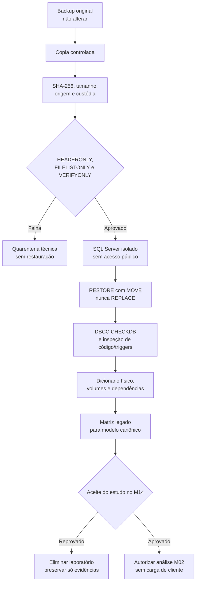

# ConnectionCyber — Estudo D01: Engenharia Reversa do Legado

> **Reclassificado em 18/08/2026:** este documento é um estudo futuro de migração, vinculado ao M14. Ele não bloqueia o desenvolvimento do ERP e não define a arquitetura canônica. A decisão vigente está em `ARQUITETURA-CANONICA-MULTISSEGMENTO.md`.

**Ambiente analisado:** staging

**Data:** 18/08/2026

**Natureza:** análise documental e técnica, somente leitura

**Produção alterada:** não

**Backup restaurado:** não

**Decisão vigente:** estudo preservado e adiado para M14; backup será necessário para migração/povoamento, não para construir o novo ERP

## 1. Parecer executivo

O projeto pode avançar tecnicamente para uma plataforma ERP web multiempresa, mas a migração não deve começar pela importação direta das tabelas antigas. As imagens documentam bem as funções do sistema legado, porém não revelam nomes físicos de tabelas, chaves, relacionamentos, triggers, procedures, versão original nem volumes. Qualquer nome de tabela de origem inferido apenas pela interface seria especulativo.

O acervo analisado não contém arquivo de banco ou backup. Foram encontrados 68 arquivos de referência, totalizando 5.495.739 bytes: 64 imagens PNG, dois documentos DOCX e dois relatórios TXT. Não foi localizado arquivo `.bak`, `.mdf`, `.ldf`, `.zip`, `.rar`, `.7z`, `.fbk`, `.fdb`, `.mdb`, `.accdb`, `.db` ou `.sqlite` no repositório staging. Portanto, nenhuma restauração foi tentada.

O parecer permanece válido como protocolo de migração futura. Quando o M14 for iniciado, o próximo ato seguro será receber uma **cópia** representativa de backup, registrar sua cadeia de custódia e submetê-la a verificações de mídia antes de qualquer restauração. O backup original deve permanecer imutável e fora do Git.

## 2. Escopo executado e limites

### Executado

- inventário somente leitura dos documentos, imagens e relatórios fornecidos;
- extração textual dos dois documentos Word sem modificá-los;
- classificação das funções exibidas nas 38 telas do sistema legado;
- comparação conceitual com o schema Supabase atual;
- inspeção somente leitura da disponibilidade local de SQL Server e ferramentas;
- definição da matriz preliminar legado → modelo canônico;
- desenho do laboratório, cadeia de custódia, rollback e critérios de aceite.

### Não executado

- restauração ou abertura de banco de cliente;
- criação ou alteração de banco SQL Server/Supabase;
- carga de dados, migration ou código ERP;
- alteração de produção, Vercel Production ou Mercado Pago;
- cópia de senhas, certificado A1 ou dados pessoais para o repositório;
- instalação ou reconfiguração de SQL Server/Docker.

## 3. Evidências e inventário

| Evidência | Resultado |
|---|---|
| Arquivos no acervo `modelo exemplo` | 68 |
| Tamanho total | 5.495.739 bytes |
| Tipos | 64 PNG, 2 DOCX, 2 TXT |
| Backup físico localizado | nenhum |
| Impressão digital agregada do inventário | `ab936514fef1d21106217b9c7ff677a0db608d1435035cfbedcb3e9cbee8f459` |
| Sistema legado observado | aplicação Windows, banco SQL Server/SQLEXPRESS |
| Conexão exibida nas telas | `LocalHost\\SQLEXPRESS`, banco `CONNECTIONCYBER`, autenticação integrada |
| Laboratório local existente | SQL Server 2022 Express (`MSSQL16.SQLEXPRESS`) |
| Ferramentas disponíveis | `sqlcmd` e Docker CLI; daemon Docker não comprovado em execução |

O hash agregado identifica o **manifesto do acervo documental**, não substitui o SHA-256 individual do futuro backup.

## 4. Conclusões sobre o legado

As telas demonstram um ERP comercial de desktop com os seguintes domínios:

- cadastros de clientes, fornecedores, funcionários, vendedores, usuários e transportadoras;
- produtos, códigos de barras, etiquetas, setores, tipos de saída, estoque e compras;
- tabela de preços, orçamento, venda/PDV, comprovantes, cartões e TEF;
- contas a receber/pagar, caixa, cheques, cobrança bancária e boletos;
- atendimento, agenda, recados, suporte e acesso a recursos remotos;
- NF-e/NFC-e, parâmetros tributários e uso de certificado A1;
- relatórios, logs, backup, manutenção, importação e exportação.

O certificado A1 é credencial fiscal. Ele não deve ser convertido em mecanismo de login e seu arquivo PFX não deve ser gravado em tabela comum. Usuários da nova plataforma serão autenticados por Supabase Auth/MFA e convidados por e-mail; senhas legadas não serão migradas.

## 5. Inconsistências de cadastro já identificadas

- o documento `LISTA DE CLIENTES.docx` contém 14 empresas;
- a configuração atual do site contém 15 posições de clientes;
- uma migration histórica menciona 10 tenants reais, mas seus `INSERTs` não foram executados em staging;
- o Supabase staging possui hoje somente um tenant ativo, a própria ConnectionCyber, e nenhum CNPJ/domínio de cliente;
- há endereços administrativos repetidos para empresas diferentes, incluindo `admin@rosevariedades.com.br` e `admin@patelariaoliveira.com.br`.

Essas divergências impedem provisionamento automático. Antes do M04/M05 deve existir um cadastro mestre validado, com CNPJ, razão social, nome fantasia, domínio, responsáveis e e-mails únicos ou explicitamente compartilhados.

## 6. Lacuna do modelo de destino

O Supabase atual oferece tenancy, autenticação e módulos do site, mas ainda não contém um modelo ERP canônico. As tabelas atuais `products`, `orders`, `order_items` e `payments` pertencem ao site e ao fluxo Mercado Pago; não devem receber produtos, vendas ou pagamentos do ERP legado. As tabelas de posicionamento/marketing também não representam estoque comercial.

Além disso, 16 das 39 tabelas públicas observadas estão sem RLS: `analytics_events`, `client_services`, `cms_content`, `courses`, `exam_questions`, `exams`, `media_files`, `products`, `quiz_answers`, `quiz_questions`, `quizzes`, `remote_automations`, `remote_configs`, `system_settings`, `trail_steps` e `trails`. Nenhuma delas será reutilizada para dados ERP sensíveis sem remodelagem e políticas específicas.

Recomenda-se criar no M02 um namespace lógico explícito, inicialmente com tabelas `erp_*`, sempre contendo `tenant_id` onde aplicável, RLS, auditoria, chaves imutáveis e mapa de IDs legados.

## 7. Matriz preliminar de migração

**Regra:** a coluna “tabela de origem” permanece como “a identificar no backup”. Ela somente será substituída por nomes físicos comprovados após `RESTORE`, inventário de catálogo e validação. Os nomes de destino são propostas arquiteturais para o M02, ainda não implementadas.

| Função antiga | Função nova | Tabela de origem | Modelo de destino proposto | Prioridade | Risco | Critério de migração |
|---|---|---|---|---:|---|---|
| Empresa e configurações gerais | Tenant, estabelecimento e parâmetros | A identificar no backup | `tenants`, `erp_establishments`, `erp_settings` | P0 | Crítico | CNPJ/identidade, regime e parâmetros reconciliados; segredos excluídos |
| Usuários e permissões detalhadas | Identidade, RBAC e MFA | A identificar no backup | `users`, `erp_user_roles`, `erp_permissions` | P0 | Crítico | Migrar perfis, nunca senhas; convite e menor privilégio validados |
| Clientes | Cadastro de pessoas/clientes | A identificar no backup | `erp_parties`, `erp_customers` | P0 | Alto | Contagem, CPF/CNPJ, contatos e duplicidades reconciliados |
| Fornecedores e transportadoras | Pessoas com papéis comerciais | A identificar no backup | `erp_parties`, `erp_suppliers`, `erp_carriers` | P1 | Alto | Documentos e vínculos preservados sem duplicar pessoas |
| Funcionários e vendedores | Equipe e representantes | A identificar no backup | `erp_employees`, `erp_sales_reps` | P1 | Alto | Situação, comissão e vínculos com vendas reconciliados |
| Produtos e código de barras | Produto, SKU e identificadores | A identificar no backup | `erp_products`, `erp_skus`, `erp_barcodes` | P0 | Crítico | Código legado imutável, EAN válido, unidade/NCM e contagem conferidos |
| Tabelas de preços | Listas e itens de preço | A identificar no backup | `erp_price_lists`, `erp_price_items` | P1 | Alto | Vigência, moeda, custo/venda e arredondamento comparados |
| Setores e tipos de saída | Depósitos e motivos de movimento | A identificar no backup | `erp_warehouses`, `erp_stock_reasons` | P0 | Alto | Todos os códigos legados mapeados sem categoria órfã |
| Estoque, entradas, saídas e inventário | Livro razão de estoque | A identificar no backup | `erp_stock_movements`, `erp_inventory_counts` | P0 | Crítico | Saldo reconstruído por produto/deposito/data coincide com legado |
| Pedidos de compra | Compras e itens | A identificar no backup | `erp_purchase_orders`, `erp_purchase_items` | P1 | Alto | Totais, status, fornecedor e recebimentos reconciliados |
| Orçamentos | Cotações comerciais | A identificar no backup | `erp_quotes`, `erp_quote_items` | P1 | Alto | Totais, validade, cliente e conversão em venda preservados |
| Vendas e PDV | Vendas, itens e recebimentos | A identificar no backup | `erp_sales`, `erp_sale_items`, `erp_receipts` | P0 | Crítico | Totais diário/item/cliente fecham; cancelamentos preservados |
| Cartões, TEF e formas de pagamento | Meios e eventos de pagamento | A identificar no backup | `erp_payment_methods`, `erp_sale_payments`, `erp_tef_events` | P1 | Crítico | Valor, NSU/autorização mascarados, parcelamento e estorno reconciliados |
| Contas a receber e a pagar | Títulos, parcelas e liquidações | A identificar no backup | `erp_financial_entries`, `erp_installments`, `erp_settlements` | P0 | Crítico | Aberto, vencido, pago, juros e datas fecham por cliente/fornecedor |
| Caixa e cheques | Sessões, movimentos e cheques | A identificar no backup | `erp_cash_sessions`, `erp_cash_movements`, `erp_cheques` | P0 | Crítico | Abertura/fechamento e saldos por caixa/data reconciliados |
| Cobrança bancária/boletos | Contas bancárias, títulos e arquivos | A identificar no backup | `erp_bank_accounts`, `erp_billing_titles`, `erp_bank_files` | P1 | Crítico | Nosso número, status, remessa/retorno e liquidação sem duplicidade |
| Atendimento e tipos | Service desk, tickets e SLA | A identificar no backup | `erp_tickets`, `erp_ticket_events`, `erp_slas` | P1 | Alto | Chamados abertos, sequência temporal, responsáveis e anexos preservados |
| NF-e/NFC-e e A1 | Documentos e eventos fiscais | A identificar no backup | `erp_fiscal_documents`, `erp_fiscal_events`, `erp_certificate_refs` | P0 | Crítico | Chave/XML/status/eventos conferidos; PFX e senha fora do banco comum |
| Logs e backups | Auditoria e histórico de importação | A identificar no backup | `erp_audit_events`, `erp_import_jobs`, `erp_import_errors` | P0 | Crítico | Ações críticas auditáveis; backup legado preservado e imutável |
| Importar/exportar/manutenção | Pipeline controlado e idempotente | A identificar no backup | `erp_import_batches`, `erp_legacy_id_map`, `erp_reconciliation_results` | P0 | Crítico | Reexecução não duplica; 100% dos registros classificados |
| Suporte/acesso remoto | Dispositivos, consentimentos e sessões | A identificar no backup | `erp_managed_devices`, `erp_remote_sessions`, `erp_support_consents` | P1 | Crítico | MFA, consentimento, expiração, revogação e log comprovados |
| Relatórios e gráficos | Visões e relatórios canônicos | A identificar no backup | views/materialized views sobre `erp_*` | P2 | Médio | Totais comparativos aprovados após reconciliação dos módulos fonte |

Prioridades: **P0** = fundação ou reconciliação obrigatória; **P1** = depende do núcleo; **P2** = derivado e posterior.

## 8. Empresa candidata ao backup representativo

A documentação de telas mais completa corresponde à Maria dos Remédios/Mania de Moda e comprova uso amplo de configurações, estoque, vendas, financeiro e SQL Server. Por isso, ela é a candidata provisória mais informativa para o primeiro laboratório.

Essa seleção só se torna definitiva depois de receber metadados da cópia do backup: empresa, data, tamanho, extensão, origem, versão estimada, abrangência funcional e confirmação de que não é o único original existente.

## 9. Arquitetura segura do laboratório

O serviço local `SQLEXPRESS` existente é SQL Server 2022 Express e pode conter bancos operacionais. Ele também tem limite de tamanho e não oferece o isolamento adequado para uma evidência de cliente. Não deve receber a restauração.

Ordem recomendada:

1. laboratório preferencial: container SQL Server 2022 Developer dedicado, volume exclusivo, sem porta pública e backup montado somente leitura;
2. alternativa, se houver incompatibilidade do backup: instância Windows Developer dedicada chamada `CCLAB`;
3. nunca usar o `SQLEXPRESS` atual, nunca usar produção e nunca executar `RESTORE ... WITH REPLACE`;
4. gerar segredo temporário fora do Git e destruir volume/container/instância de laboratório somente por identificadores exatos após o aceite;
5. preservar manifesto, hashes, dicionário, contagens e relatório de reconciliação; não preservar cópias desnecessárias de dados.

### Fluxo gráfico

## 10. Portões determinísticos futuros do M14

| Portão | Ação | Validação obrigatória | Estado atual |
|---|---|---|---|
| M14-D0 | Inventário documental | lista, tipos, tamanho e hash do manifesto | Aprovado |
| M14-D1 | Recepção da cópia | caminho fora do Git, metadados, SHA-256 e prova de original preservado | Aguardando o início do M14 |
| M14-D2 | Inspeção da mídia | `RESTORE HEADERONLY`, `FILELISTONLY` e `VERIFYONLY` sem erro | Não iniciado |
| M14-D3 | Restauração isolada | versão compatível, `MOVE`, nome exclusivo e zero `REPLACE` | Não iniciado |
| M14-D4 | Integridade e segurança | `DBCC CHECKDB`; inventário de usuários, código, triggers e integrações | Não iniciado |
| M14-D5 | Dicionário e reconciliação | tabelas/chaves/volumes/dependências e matriz com origem física | Não iniciado |
| M14-D6 | Encerramento | relatório aprovado e laboratório removido com evidências preservadas | Não iniciado |

Cada portão será validado antes do próximo. Falha em G2, G3 ou G4 encerra a tentativa sem contornar controles.

## 11. Critérios de aceite do estudo no M14

O estágio de engenharia reversa do M14 só será considerado validado quando houver:

- SHA-256 e cadeia de custódia da cópia analisada;
- versão e propriedades reais do backup;
- restauração isolada e verificável, sem alterar o original;
- `DBCC CHECKDB` sem corrupção não tratada;
- inventário de schemas, tabelas, colunas, PK/FK, índices, views, triggers, procedures e funções;
- contagens e volumes por entidade crítica;
- dependências externas, logins e integrações identificados;
- matriz atualizada com tabelas de origem comprovadas;
- relatório de diferenças entre clientes, se houver segundo backup;
- plano de extração e rollback do importador;
- remoção controlada do laboratório ao final.

## 12. Ação futura autorizável no M14

Disponibilizar uma **cópia** do backup representativo em diretório protegido e fora do repositório Git, informando o caminho exato. Não enviar a única cópia original, senha de A1 ou credenciais em mensagem.

Comando de aceite sugerido:

`M14 autorizado; disponibilizar cópia do backup da Mania de Moda em [caminho] e executar M14-D1.`

Se outro cliente for escolhido, substitua o nome no comando. Nenhuma restauração ocorrerá antes da validação explícita do M14-D1. Este comando não é o próximo portão atual do projeto.

## 13. Referências técnicas

- Microsoft Learn — [RESTORE (Transact-SQL)](https://learn.microsoft.com/en-us/sql/t-sql/statements/restore-statements-transact-sql?view=sql-server-ver17)
- Microsoft Learn — [Restore Database: página geral](https://learn.microsoft.com/en-us/sql/relational-databases/backup-restore/restore-database-general-page?view=sql-server-2016)
- Microsoft Learn — [Restaurar sob modelo de recuperação simples](https://learn.microsoft.com/en-us/sql/relational-databases/backup-restore/restore-a-database-backup-under-the-simple-recovery-model-transact-sql?view=sql-server-2017)
- Microsoft Learn — [Atualizações suportadas para SQL Server 2022](https://learn.microsoft.com/en-us/sql/database-engine/install-windows/supported-version-and-edition-upgrades-2022?view=sql-server-ver17)
- Microsoft Learn — [Restaurar backup em container SQL Server](https://learn.microsoft.com/en-us/sql/linux/migrate/tutorial-restore-backup-sql-server-container?view=sql-server-ver15)
- Microsoft Learn — [Edições e recursos do SQL Server 2022](https://learn.microsoft.com/en-us/sql/sql-server/editions-and-components-of-sql-server-2022?view=sql-server-ver17)

---

ConnectionCyber Assessoria e Treinamento — Tecnologia que traz conhecimento e gestão.
