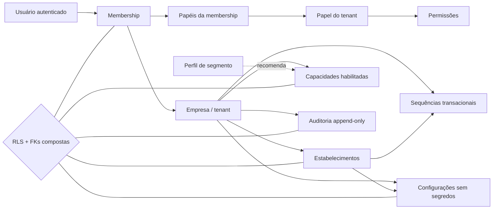
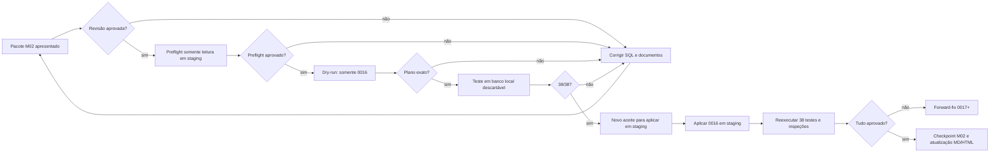

# ConnectionCyber — Parecer técnico M02

## Fundação ERP multiempresa e multissegmento

**Ambiente:** `connectioncyber-staging`

**Data:** 18/08/2026

**Versão:** 1.1.0

**Situação:** preflight, dry-run e laboratório local aprovados; ainda não aplicado no Supabase staging

**Produção alterada:** não

## 1. Parecer executivo

O desenho físico do M02 é **tecnicamente favorável para validação em laboratório e, depois, no Supabase staging**, desde que os portões descritos neste documento sejam respeitados.

A migration `0016_erp_foundation.sql` é aditiva e cria uma fundação independente do sistema legado. Ela não cria produtos, vendas, estoque, fiscal, Mercado Pago, certificado A1 nem importa dados de clientes. Seu objetivo é estabelecer as fronteiras que todos os módulos futuros deverão obedecer:

- usuário pode participar de uma ou mais empresas por membership;
- cada registro operacional pertence a uma empresa (`tenant_id`);
- loja, filial, oficina ou unidade é representada por estabelecimento;
- segmentos habilitam combinações de capacidades, sem criar versões diferentes do ERP;
- papéis e permissões não podem cruzar empresas por erro de referência;
- configurações comuns não podem receber chaves com nomes de segredo;
- numerações são alocadas de forma transacional;
- auditoria é append-only;
- navegador autenticado começa com leitura protegida por RLS e sem escrita direta.

**Conclusão deste portão:** o SQL pode ser revisado. Ainda não há autorização para `db push`, aplicação remota ou povoamento.

## 2. Como a fundação ficará

Exemplos de composição, usando o mesmo núcleo:

| Empresa | Perfil primário | Capacidades adicionais possíveis |
|---|---|---|
| Papelaria/variedades | `apparel_stationery` | variações, etiquetas, estoque, PDV, fiscal |
| Varejo geral | `retail_general` | compras, orçamentos, caixa, financeiro |
| Oficina | `workshop` | veículos, ativos, ordens de serviço, peças |
| Restaurante/lanchonete | `food_service` | receitas, lotes, mesas, comandas, cozinha |
| Prestador de serviços | `professional_services` | agenda futura, OS, atendimento, financeiro |

Um perfil é somente um template de recomendação. A fonte efetiva do que a empresa utiliza será `erp_tenant_capabilities`.

## 3. Migration apresentada

**Arquivo:** `supabase/migrations/0016_erp_foundation.sql`

### 3.1 Objetos criados

| Grupo | Tabela | Função |
|---|---|---|
| Identidade | `erp_tenant_memberships` | vínculo usuário ↔ empresa, com vigência e status |
| Identidade | `erp_roles` | papéis próprios de cada empresa |
| Identidade | `erp_permissions` | catálogo global de ações autorizáveis |
| Identidade | `erp_role_permissions` | permissões concedidas ao papel |
| Identidade | `erp_membership_roles` | papéis concedidos à membership |
| Organização | `erp_establishments` | matriz, filial ou unidade operacional |
| Capacidades | `erp_capability_catalog` | catálogo técnico global do ERP |
| Capacidades | `erp_tenant_capabilities` | capacidades realmente habilitadas por empresa |
| Segmentos | `erp_segment_profiles` | cinco perfis iniciais reutilizáveis |
| Segmentos | `erp_segment_profile_capabilities` | recomendações de capacidade por perfil |
| Segmentos | `erp_tenant_segment_profiles` | perfis associados à empresa |
| Configuração | `erp_tenant_settings` | parâmetros JSON sem credenciais |
| Operação | `erp_number_sequences` | numeração concorrente por empresa/unidade |
| Auditoria | `erp_audit_events` | eventos imutáveis de negócio e segurança |

Total: **14 tabelas**, todas com RLS habilitada.

### 3.2 Catálogos globais incluídos

A migration cadastra somente referências técnicas, sem clientes:

- 8 permissões iniciais;
- 23 capacidades do ERP;
- 5 perfis de segmento;
- associações recomendadas entre perfil e capacidade.

Esses dados são infraestrutura do produto. Não há CNPJ, razão social, e-mail, estoque, preço, venda ou informação fiscal real.

### 3.3 Decisões de segurança

- `erp_security` não está nos schemas expostos pelo Data API.
- Helpers `security definer` usam `search_path` vazio e nomes totalmente qualificados.
- `anon` não recebe privilégio nas tabelas ERP.
- `authenticated` recebe somente `SELECT`; não recebe `INSERT`, `UPDATE` ou `DELETE`.
- Escritas permanecem server-only até a implementação dos fluxos de autorização do M04.
- FKs compostas `(tenant_id, id)` impedem associar membership, papel ou estabelecimento de outra empresa.
- A auditoria rejeita `UPDATE` e `DELETE`; correções devem ser novos eventos.
- A membership referenciada por auditoria não poderá ser apagada; deve ser revogada, preservando histórico.
- Chaves de configuração contendo `secret`, `password`, `token`, `credential`, `certificate` ou `pfx` são recusadas.
- A alocação de números usa bloqueio de linha (`FOR UPDATE`) e não é executável pelo usuário autenticado.

### 3.4 Compatibilidade com o projeto atual

O desenho não substitui imediatamente `users.tenant_id` nem modifica as funções de login existentes. As memberships entram de modo aditivo. A troca da resolução de empresa ativa será feita no M03/M04, com teste de compatibilidade.

`erp_capability_catalog` também não reutiliza `module_catalog`: o primeiro descreve funções técnicas do ERP; o segundo continua descrevendo serviços comerciais da ConnectionCyber.

## 4. Pacote de testes apresentado

### 4.1 Pré-validação remota, somente leitura

**Arquivo:** `supabase/preflight/0016_erp_foundation_preflight.sql`

Ele interrompe o processo se:

- PostgreSQL for anterior à versão 15;
- `tenants`, `users`, `set_updated_at` ou `is_platform_staff` estiverem ausentes;
- qualquer uma das 14 tabelas já existir;
- o schema privado `erp_security` já existir;
- a versão `0016` já constar no histórico remoto.

O preflight não cria nem altera objetos.

### 4.2 Testes automatizados pgTAP

**Arquivo:** `supabase/tests/0016_erp_foundation.test.sql`

Foram especificadas **38 asserções**:

| Bloco | Cobertura |
|---|---|
| Estrutura | schema privado e 14 tabelas presentes |
| RLS | RLS habilitada nas 14 tabelas |
| Seeds | 23 capacidades e 5 perfis |
| Grants | sem DML para `authenticated`; sem privilégios para `anon` |
| Funções | helpers mínimos liberados; numeração negada ao navegador |
| Isolamento | usuário A não enxerga memberships, unidades, capacidades, configurações, perfis e papéis de B |
| Auditoria | ator vê o próprio evento; update/delete são bloqueados |
| Integridade | referências cross-tenant de papel/estabelecimento, segredo em configuração e ator incompatível falham |
| Concorrência básica | sequência retorna `A-0001` e depois `A-0002` |

Os fixtures usam domínios `.invalid`, UUIDs sintéticos e transação com `ROLLBACK`; não são dados de cliente.

### 4.3 Rollback e forward-fix

**Arquivo:** `supabase/rollback/0016_erp_foundation.rollback.sql`

O rollback é deliberadamente bloqueado e serve apenas para laboratório local descartável. Ele exige duas confirmações explícitas e recusa execução se encontrar qualquer linha vinculada a tenant.

Depois que uma migration for aplicada em ambiente compartilhado ou receber dados, a estratégia oficial é **forward-fix**: criar uma migration `0017+` aditiva/corretiva, preservar o histórico e executar novos testes. Não se apaga uma fundação com dados para “voltar”.

## 5. Validações já realizadas nesta apresentação

| Verificação | Evidência | Resultado |
|---|---|---|
| Escopo do Git | somente `connectioncyber-staging` | aprovado |
| Produção | nenhum arquivo alterado nesta etapa | aprovado |
| Transação da migration | um `BEGIN` e um `COMMIT` | aprovado |
| Quantidade estrutura/RLS/policies | 14/14/14 | aprovado |
| Busca por segredos e dados reais conhecidos | nenhuma ocorrência | aprovado |
| Espaços/erros de patch | `diff --check` sem achados | aprovado |
| Preflight remoto | `M02_PREFLIGHT_OK`, PostgreSQL 17.6 | aprovado |
| Dry-run remoto | somente `0016_erp_foundation.sql`; zero seeds/roles | aprovado |
| Primeira aplicação local | migrations `0001`–`0016` sem erro | aprovado |
| Primeira suíte pgTAP | `Files=1, Tests=38, Result: PASS` | 38/38 |
| Rollback local protegido | 14 tabelas e schema privado removidos | aprovado |
| Reconstrução local | reset `--local --no-seed`, migrations `0001`–`0016` | aprovado |
| Segunda suíte pgTAP | `Files=1, Tests=38, Result: PASS` | 38/38 |
| Encerramento do laboratório | `stop --project-id connectioncyber --no-backup` | volumes descartados |
| Supabase staging após o laboratório | histórico 0016=`false`; tabelas ERP=`0` | inalterado |
| Aplicação no Supabase staging | depende de novo aceite específico | não executada |
| Checkpoint Git | `d5f5ce1` enviado exclusivamente para `origin/staging` | aprovado |
| GitHub Actions | Quality Gates `32194798896` | sucesso |
| Vercel | status do commit `success`; deployment concluído | sucesso |
| Alias Preview | HTTP 200 em `connectioncyber-git-staging-connectioncyberso.vercel.app` | sucesso |

Portanto, o resultado correto deste momento é **migration validada localmente e pronta para um portão separado de aplicação em staging**. Ela ainda não foi aplicada remotamente.

### 5.1 Ocorrências controladas do laboratório

- A primeira inicialização da pilha local completa parou porque o serviço auxiliar `postgres-meta` não ficou saudável dentro do tempo. O banco foi reiniciado no modo mínimo, somente PostgreSQL, que é suficiente para migrations e pgTAP.
- A migration histórica `0006_povoamento_tenants_reais.sql` faz parte da cadeia local e é executada durante resets. Esses cadastros ficaram confinados ao banco descartável; o dry-run remoto comprovou que `0006` não seria reenviada, e o volume local foi removido ao final com `--no-backup`.
- A primeira tentativa de chamar o rollback pela interface preparada da CLI executou apenas o primeiro comando. Nenhum objeto foi removido. A execução foi refeita na mesma sessão pelo cliente PostgreSQL local e terminou com `COMMIT`, seguida de contagens zero.

## 6. Riscos e controles

| ID | Risco | Nível | Controle deste M02 | Condição residual |
|---|---|---:|---|---|
| M02-R1 | vazamento entre empresas | crítico | RLS, memberships e FKs compostas | executar 38 testes em banco descartável e staging |
| M02-R2 | escrita direta pelo navegador | crítico | grants somente leitura | comandos de escrita entram apenas com serviços do M04 |
| M02-R3 | segredo em configuração comum | crítico | bloqueio por chave e regra documental | A1 terá cofre/serviço específico no M13 |
| M02-R4 | números duplicados sob concorrência | alto | unicidade de escopo + lock de linha | teste concorrente ampliado no módulo transacional |
| M02-R5 | perda de auditoria | alto | append-only e delete restrito | política de retenção/backup ainda será definida |
| M02-R6 | acesso administrativo amplo | alto | somente papel de equipe existente e RLS | rotas administrativas auditadas serão exigidas no M03/M04 |
| M02-R7 | rollback após dados | crítico | script recusa se houver linhas de tenant | usar sempre forward-fix em ambiente compartilhado |
| M02-R8 | incompatibilidade com login atual | alto | memberships aditivas; `users.tenant_id` preservado | resolver empresa ativa somente no M03/M04 |
| M02-R9 | migration histórica `0006` repovoa cadastros em resets locais | alto | laboratório isolado; dry-run remoto seleciona apenas 0016 | revisar a política de fixtures históricas antes do M14/piloto |

## 7. Processo determinístico de execução

Cada caixa é um portão. Nenhuma falha autoriza pular para a seguinte.

## 8. Próximo aceite solicitado

O próximo passo é um novo portão e autoriza somente o Supabase staging:

1. repetir a confirmação de projeto vinculado `ozvylnaipubrmaadikvk`;
2. executar `db push` selecionando exclusivamente `0016`;
3. consultar o histórico e os 14 objetos criados;
4. executar as 38 asserções contra o Supabase staging dentro de transação com rollback;
5. verificar grants, RLS e ausência de dados sintéticos remanescentes;
6. atualizar MD/HTML e criar checkpoint;
7. não alterar produção, dados reais, fiscal, A1 ou Mercado Pago.

Frase de aceite sugerida:

> **M02 laboratório aprovado; aplicar 0016 exclusivamente no Supabase staging e executar validação remota.**
