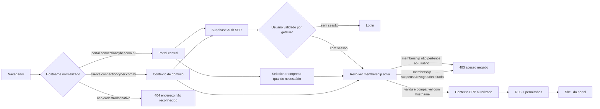
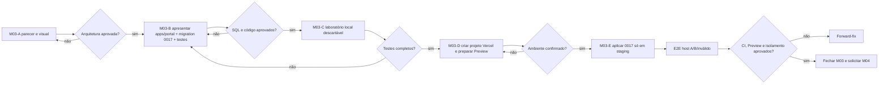

# ConnectionCyber — Parecer técnico M03

## Portal do cliente, subdomínios e resolução segura de empresa

**Ambiente analisado:** `connectioncyber-staging`

**Data:** 18/08/2026

**Versão:** 1.0.0

**Situação:** arquitetura e experiência propostas; nenhuma implementação M03 executada

**Produção alterada:** não

## 1. Parecer executivo

O M03 é **tecnicamente viável**, mas não deve ser implementado dentro de `apps/site` nem reaproveitar `apps/platform` como portal de cliente.

A recomendação é criar uma terceira aplicação Next.js no mesmo monorepo:

- `apps/site`: site institucional, conteúdo público, área de alunos e pagamentos;
- `apps/platform`: painel interno da equipe ConnectionCyber, com visão administrativa cross-tenant;
- `apps/portal`: ERP dos clientes, sempre limitado a memberships ativas da sessão.

O portal terá um único código e um único banco por ambiente. Cada empresa será resolvida por hostname e por membership, sem forks, bancos ou repositórios individuais.

**Decisão central de segurança:** hostname identifica o contexto solicitado, mas não concede acesso. A autorização exige a interseção:

`hostname ativo` + `tenant ativo` + `usuário autenticado` + `membership ativa`.

O `tenant_id` vindo de formulário, URL, query string, cabeçalho inventado pelo navegador ou armazenamento local nunca será aceito como autoridade.

## 2. Estado atual comprovado

| Componente | Estado encontrado | Consequência para M03 |
|---|---|---|
| `apps/portal` | não existe | deve ser criado somente após aprovação deste parecer |
| `apps/site` | Pages Router, público/alunos/pagamentos | não deve receber o ERP dos clientes |
| `apps/platform` | App Router, exclusivo da equipe | não deve ser liberado para clientes |
| Vercel atual | projeto `connectioncyber`, Root Directory de `apps/site` | portal precisa de projeto Vercel próprio no mesmo monorepo |
| CI | valida apenas `site` e `platform` | implementação M03 deverá adicionar job `portal` |
| Supabase Auth | SSR já usado no painel; login por senha existente | padrão pode ser reutilizado, com guard próprio do portal |
| `users.tenant_id` | modelo antigo de um tenant principal | não pode ser a autoridade do novo portal |
| `erp_tenant_memberships` | criada e validada pelo M02 | será a fonte de participação do usuário em empresas |
| `tenants.slug` | existe, sem regra forte de hostname | pode servir como identificador legível, não como autorização |
| `tenants.dominio` | coluna simples, sem restrição de unicidade nem modelo de verificação/histórico | será preservada como legado e não será a fonte canônica do M03 |
| domínio público | `www` aponta por CNAME para Vercel | site atual permanece como está |
| nameservers | `ns1.dns-parking.com` e `ns2.dns-parking.com` | wildcard Vercel não deve ser ativado agora |

Também foi confirmado que o M02 deixou as tabelas tenant-owned vazias. Não existe membership real a ser usada pelo portal neste momento; testes M03 deverão usar somente fixtures transacionais.

## 3. Arquitetura recomendada

### 3.1 Aplicação

`apps/portal` deverá usar:

- Next.js 15 App Router e TypeScript, alinhados ao painel atual;
- `@supabase/ssr` para sessão em cookies;
- Server Components, Route Handlers e Server Actions para operações sensíveis;
- `getUser()` no servidor para validar o JWT;
- páginas autenticadas dinâmicas e não armazenadas em cache público;
- identidade visual oficial ConnectionCyber, com possibilidade futura de marca complementar do tenant;
- porta local sugerida `3021`, evitando conflito com site `3000` e platform `3011`.

### 3.2 Deploy

O portal deve ser um **novo projeto Vercel no mesmo repositório**, com Root Directory `apps/portal`. Isso preserva isolamento de variáveis, domínios, logs e deployment protection, sem criar novo GitHub ou novo Supabase.

Ambientes propostos:

| Ambiente | Branch | Supabase | Host inicial |
|---|---|---|---|
| Desenvolvimento local | local | Supabase local descartável | `portal.localhost:3021` e `<tenant>.localhost:3021` |
| Staging | `staging` | `ozvylnaipubrmaadikvk` | URL Preview; domínio explícito de teste após autorização |
| Produção futura | `main` | `qfggetvashdxyuvlhihq` | `portal.connectioncyber.com.br` |

Produção não será criada nem conectada durante a implementação de staging do M03.

## 4. Estratégia de subdomínios

### 4.1 Fase inicial aprovada para proposta

- entrada central: `portal.connectioncyber.com.br`;
- endereço opcional por empresa: `<slug>.connectioncyber.com.br`;
- cada subdomínio piloto será cadastrado explicitamente no DNS e no projeto Vercel;
- o hostname será cadastrado em tabela própria e precisa estar `active`;
- nenhum hostname será inferido apenas a partir do `slug`.

### 4.2 Por que não usar wildcard agora

O domínio usa nameservers externos (`dns-parking.com`). A documentação atual da Vercel exige o método de nameservers para adicionar um wildcard como `*.connectioncyber.com.br`. Mudar os nameservers pode afetar site, e-mail e outros registros DNS.

Portanto, o M03 **não autoriza migração de DNS nem wildcard**. Para o piloto, subdomínios explícitos são suficientes e reversíveis. Uma eventual migração de nameservers terá portão próprio com inventário DNS, TTL, janela, teste e rollback.

### 4.3 Cookies e troca de empresa

Na primeira versão, cookies de sessão serão host-only. Não será definido `Domain=.connectioncyber.com.br`, evitando compartilhar tokens com `www`, site institucional ou outros subdomínios.

- no host central, o usuário escolhe entre suas memberships;
- no host de uma empresa, o usuário autentica naquele host e só entra se possuir membership compatível;
- trocar para outra empresa pelo host central grava apenas o identificador da membership em cookie `HttpOnly`, `Secure` e `SameSite=Lax`;
- mesmo que esse identificador seja adulterado, a consulta RLS precisa retornar uma membership ativa pertencente ao usuário.

Login único entre subdomínios poderá ser estudado depois, mas não faz parte do M03 inicial.

## 5. Resolução canônica de hostname

O M03 deverá apresentar uma migration aditiva `0017_portal_tenant_resolution.sql`, sem executá-la antes de novo aceite.

### 5.1 Tabela proposta

`erp_tenant_domains`:

| Campo lógico | Finalidade |
|---|---|
| `id` | identificador opaco do vínculo de domínio |
| `tenant_id` | empresa proprietária do domínio |
| `hostname` | hostname minúsculo, sem protocolo, porta, path ou ponto final |
| `kind` | `subdomain` ou `custom` |
| `status` | `pending`, `verified`, `active` ou `disabled` |
| `is_primary` | endereço canônico do tenant |
| `verification_token_hash` | prova futura de domínio customizado, nunca token em claro |
| `verified_at` | momento da verificação |
| `created_at` / `updated_at` | trilha operacional |

Regras obrigatórias:

- hostname único e normalizado;
- apenas um domínio primário ativo por tenant;
- RLS habilitada;
- `anon` sem acesso direto à tabela;
- `authenticated` enxerga somente domínios de tenants nos quais possui membership ativa;
- equipe administrativa gerencia domínios apenas por serviço server-side auditado;
- `tenants.dominio` não é apagada no M03.

### 5.2 Resolução pré-login

Um wrapper público mínimo, `portal_resolve_host(text)`, poderá devolver apenas conteúdo seguro para montar a tela de entrada:

- identificador opaco do domínio;
- slug público;
- nome de exibição;
- logo/tema público quando configurado;
- nenhuma informação cadastral, fiscal, contratual ou de usuário.

O wrapper será `security definer`, com `search_path` vazio, validação estrita de hostname e permissão de execução limitada. A tabela continuará sem `SELECT` para `anon`.

## 6. Fluxos de tela propostos

### 6.1 Host central

1. usuário abre `portal.connectioncyber.com.br`;
2. sem sessão: tela de login ConnectionCyber;
3. com uma membership ativa: entrada direta;
4. com várias memberships: tela **Selecionar empresa**;
5. com nenhuma membership: tela **Conta sem empresa autorizada**.

### 6.2 Host de empresa

1. hostname é normalizado e resolvido;
2. domínio desconhecido, pendente, desativado ou tenant inativo retorna 404 neutro;
3. domínio válido apresenta login com nome público da empresa e selo “Tecnologia ConnectionCyber”;
4. após autenticar, membership precisa pertencer ao mesmo tenant;
5. divergência retorna 403 sem expor dados da empresa;
6. sucesso abre o shell ERP no tenant correto.

### 6.3 Shell inicial do portal

O primeiro shell será deliberadamente enxuto:

- topbar com empresa ativa, estabelecimento e usuário;
- navegação lateral gerada pelas capacidades do tenant;
- início com atalhos neutros e estado “módulos em implantação”;
- seletor de empresa apenas no host central e somente quando houver mais de uma membership;
- sair sempre visível;
- nenhuma escrita operacional no M03.

## 7. Mapa inicial de rotas

| Rota | Acesso | Comportamento |
|---|---|---|
| `/login` | público em host reconhecido | autentica sem aceitar redirect externo |
| `/auth/callback` | público controlado | troca código PKCE; destino deve estar na allowlist |
| `/selecionar-empresa` | autenticado no host central | lista apenas memberships ativas da sessão |
| `/` | autenticado e contextualizado | shell inicial do ERP |
| `/acesso-negado` | autenticado | 403 sem dados do tenant |
| `/dominio-nao-reconhecido` | público | 404 neutro; sem formulário de login |
| `/sessao-expirada` | público | orienta nova autenticação |

O parâmetro `redirect` será aceito somente como caminho relativo interno conhecido. URLs absolutas, `//host`, barras invertidas e esquemas externos serão recusados para impedir open redirect.

## 8. Invariantes de segurança

1. hostname nunca concede acesso sozinho;
2. sessão é validada no servidor com `getUser()`;
3. `users.tenant_id` não decide o contexto do portal;
4. membership precisa estar ativa, dentro da vigência e ligada ao usuário autenticado;
5. contexto do hostname e tenant da membership precisam coincidir;
6. domínio desconhecido é negado por padrão;
7. nenhuma rota autenticada usa ISR ou cache público;
8. respostas de autenticação/sessão usam `private, no-store`;
9. portal não usa service role no navegador nem em middleware distribuído;
10. `anon` não lê tabelas de domínio ou membership diretamente;
11. equipe ConnectionCyber não recebe entrada automática no portal por `is_platform_staff()`;
12. suporte cross-tenant permanece no `apps/platform` e, futuramente, em fluxo quebra-vidro auditado;
13. logs não registram token, cookie, senha ou PII desnecessária;
14. writes continuam fora do M03; M04 entregará RBAC, convites e MFA.

### 8.1 Atenção especial ao acesso da equipe

As policies do M02 permitem que `is_platform_staff()` leia dados cross-tenant para uso do painel interno. Por isso, o portal não pode interpretar “a consulta retornou uma linha” como autorização suficiente.

O guard do portal deverá exigir explicitamente:

`membership.user_id = auth.uid()` e `membership.status = 'active'`.

Isso impede que um administrador entre silenciosamente no ERP de um cliente apenas por possuir papel de equipe.

## 9. Limite entre M03 e M04

| M03 entrega | M04 entrega |
|---|---|
| aplicação `apps/portal` e shell protegido | convites, criação e suspensão de usuários |
| resolução de hostname e tenant ativo | CRUD de papéis e concessões |
| login existente e callback seguro | MFA e políticas de autenticação reforçadas |
| seleção de membership existente | administração de memberships |
| isolamento, 404/403 e sessão | autorização por ação/módulo e matriz completa |
| navegação baseada em capacidades somente leitura | comandos server-side autorizados e auditados |

O M03 não deve antecipar o painel de usuários nem criar senhas para clientes.

## 10. Testes obrigatórios da futura implementação

### 10.1 Unidade

- normalização de hostname, porta local e ponto final;
- rejeição de hostname inválido, comprido ou desconhecido;
- redirect interno seguro e bloqueio de open redirect;
- cálculo de estado da membership: ativa, futura, expirada, suspensa e revogada;
- host central versus host de tenant.

### 10.2 Banco/pgTAP

- unicidade case-insensitive do hostname;
- somente um domínio primário ativo por tenant;
- `anon` sem `SELECT` na tabela;
- resolver público retorna somente campos permitidos;
- usuário A não lê domínio/membership de B;
- domínio A + membership B é recusado;
- staff sem membership não passa pelo guard do portal;
- fixtures removidos por rollback.

### 10.3 Integração/E2E

- host A + usuário A = 200;
- host A + usuário B = 403;
- host inexistente = 404;
- usuário sem sessão = login;
- uma membership = entrada direta;
- várias memberships no host central = seletor;
- membership suspensa/revogada/expirada = 403;
- cookie de membership adulterado = 403;
- sessão expirada = novo login;
- páginas autenticadas sem cache compartilhado;
- nenhuma referência ao Supabase de produção no bundle/Preview de staging.

### 10.4 Quality Gates

- testes do portal;
- TypeScript;
- lint;
- build;
- teste de dependências;
- smoke test do Preview;
- verificação de headers e cache;
- matriz de hosts/usuários com fixtures sintéticos.

## 11. Riscos e controles

| ID | Risco | Nível | Controle proposto |
|---|---|---:|---|
| M03-R1 | host spoofing ou resolução permissiva | crítico | normalização estrita, lookup exato e deny-by-default |
| M03-R2 | usuário de B acessar A | crítico | host + membership + RLS + testes negativos |
| M03-R3 | staff entrar no portal por bypass cross-tenant | crítico | guard exige membership do próprio `auth.uid()` |
| M03-R4 | cookie/sessão de um usuário servido a outro por cache | crítico | rotas dinâmicas, `private, no-store`, sem ISR autenticado |
| M03-R5 | open redirect após login | alto | somente caminhos internos allowlisted |
| M03-R6 | service role exposta no Edge/browser | crítico | resolver público mínimo; nenhuma service role no portal cliente/middleware |
| M03-R7 | mudança DNS interromper site/e-mail | crítico | não mudar nameservers; usar subdomínios explícitos no piloto |
| M03-R8 | colisão de slug/domínio | alto | tabela canônica, unicidade e nomes reservados |
| M03-R9 | sessão compartilhada entre subdomínios ampliar superfície | alto | cookies host-only na primeira versão |
| M03-R10 | Vercel Preview usar Supabase produção | crítico | variáveis separadas e inspeção de bundle/ambiente |
| M03-R11 | domínio desativado continuar em cache | alto | TTL curto para resolução pública e invalidação administrativa futura |
| M03-R12 | portal assumir dados/roles ainda inexistentes | alto | fixtures transacionais; provisionamento real somente no M04/M15 |

## 12. Processo determinístico proposto

Cada etapa terá evidência e aceite antes da seguinte. Nenhum domínio de produção, usuário real ou dado de cliente será necessário para provar o M03.

## 13. Referências técnicas verificadas

- Vercel — Monorepos: um projeto por diretório do mesmo repositório: <https://vercel.com/docs/monorepos>
- Vercel — Multi-tenant: um deployment pode servir múltiplos domínios/subdomínios: <https://vercel.com/kb/guide/nextjs-multi-tenant-application>
- Vercel — Wildcard exige configuração por nameservers: <https://vercel.com/docs/domains/working-with-domains>
- Supabase — SSR armazena e renova sessão em cookies: <https://supabase.com/docs/guides/auth/server-side>
- Supabase — rotas autenticadas não devem usar cache compartilhado/ISR: <https://supabase.com/docs/guides/auth/server-side/advanced-guide>
- Supabase — Redirect URLs e padrões de Preview: <https://supabase.com/docs/guides/auth/redirect-urls>

## 14. Próximo aceite solicitado

O próximo portão autoriza criar **somente em staging** o pacote revisável da implementação M03:

1. esqueleto `apps/portal`;
2. middleware/guards e telas de estado;
3. migration `0017_portal_tenant_resolution.sql`;
4. preflight, testes unitários e pgTAP;
5. atualização do CI para incluir `portal`;
6. sem aplicar a migration remotamente;
7. sem criar projeto/domínio Vercel ainda;
8. sem produção, cliente real, A1, fiscal, Mercado Pago ou backup legado.

Frase de aceite sugerida:

> **Parecer M03 aprovado; apresentar código, migration 0017 e testes do portal, sem aplicar remotamente.**
