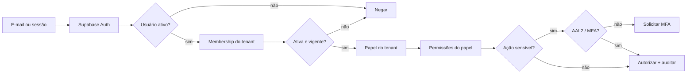
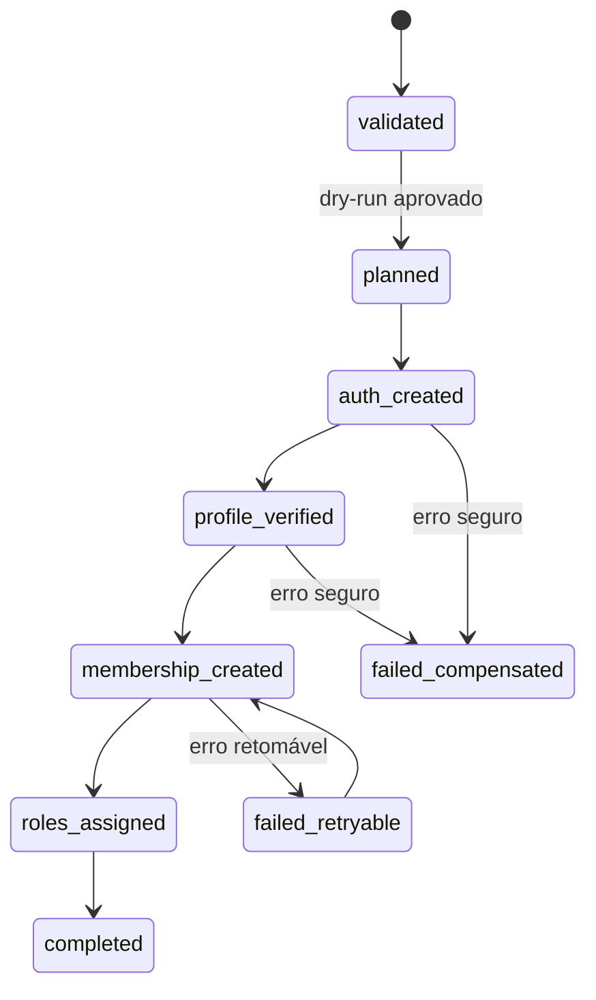

# ConnectionCyber — Parecer técnico M04-G0

## Identidade de teste, RBAC, MFA e provisionamento seguro

**Ambiente:** `connectioncyber-staging`

**Data:** 18/08/2026

**Versão:** 1.0.0

**Estado:** arquitetura e critérios definidos; nenhuma conta criada

**Produção alterada:** não

## 1. Decisão executiva

O M04 usará uma identidade única do Supabase Auth e autorização separada por
empresa. E-mail identifica o principal, mas não concede tenant, papel ou
permissão. O acesso efetivo será sempre a interseção:

`usuário válido` + `membership ativa` + `tenant ativo` + `papel ativo` +
`permissão explícita` + `nível MFA exigido`.

As 14 contas administrativas de teste não serão criadas manualmente nem neste
portão. Primeiro será construído e testado um provisionador idempotente,
server-only, com dry-run, auditoria e limpeza segura.

## 2. Estado atual comprovado

Auditoria somente leitura no Supabase staging `ozvylnaipubrmaadikvk`:

| Objeto | Quantidade | Leitura técnica |
|---|---:|---|
| `auth.users` | 3 | contas preexistentes; nenhuma pertence à lista nova |
| `public.users` | 3 | zero perfis órfãos |
| fatores MFA | 0 | AAL2 ainda não foi provado |
| `erp_tenant_memberships` | 0 | nenhum cliente provisionado |
| `erp_roles` | 0 | catálogo por tenant ainda vazio |
| `erp_membership_roles` | 0 | nenhuma concessão ERP |
| `erp_permissions` | 8 | fundação M02 disponível |
| `roles` legado | 7 | papéis globais da plataforma |
| `user_roles` legado | 3 | uma concessão atual reconhecida como equipe |

As oito permissões existentes são `foundation.read`, `foundation.manage`,
`memberships.read`, `memberships.manage`, `roles.manage`, `audit.read`,
`capabilities.manage` e `sequences.allocate`.

## 3. Separação obrigatória de conceitos

| Camada | Fonte canônica | Autoridade permitida |
|---|---|---|
| autenticação | `auth.users` | sessão, identidade e fatores MFA |
| perfil humano | `public.users` | nome, estado e dados não secretos |
| equipe ConnectionCyber | `roles` + `user_roles` | acesso global ao painel interno |
| vínculo empresarial | `erp_tenant_memberships` | participação do usuário em um tenant |
| papel empresarial | `erp_roles` + `erp_membership_roles` | função exercida dentro daquele tenant |
| autorização | `erp_permissions` + `erp_role_permissions` | ação permitida naquele tenant |
| domínio do portal | `erp_tenant_domains` | contexto solicitado, nunca autorização |
| auditoria | `erp_audit_events` | ator, tenant, ação, resultado e correlação |

`public.users.tenant_id` permanecerá apenas como compatibilidade transitória.
Ele não será autoridade do ERP e não poderá representar um usuário
multiempresa.

## 4. Fluxo canônico de acesso

O navegador nunca enviará `tenant_id`, `role` ou `permission` como fonte de
autoridade. Esses valores serão derivados no servidor a partir da sessão.

## 5. Achados e riscos do baseline

| ID | Severidade | Achado | Controle M04 obrigatório |
|---|---:|---|---|
| I-001 | Crítica | `handle_new_user` aceita `tenant_id` de `raw_user_meta_data`, campo não apropriado para autorização. | Remover a confiança; tenant somente por comando administrativo server-only. |
| I-002 | Alta | Usuário sem metadata cai no tenant ConnectionCyber pelo modelo legado. | Perfil sem tenant autoritativo; membership criada separadamente. |
| I-003 | Alta | `custom_access_token_hook` modela um único `tenant_id`. | Não gravar tenant ativo fixo no JWT; autorizar por membership/RLS. |
| I-004 | Alta | Configuração local permite signup, confirmação desligada e senha mínima 6 sem composição. | Fechar signup público do portal e definir política forte por ambiente. |
| I-005 | Alta | TOTP está desligado e não há fator MFA no staging. | Habilitar e provar AAL2 para equipe e administradores privilegiados. |
| I-006 | Alta | `SECURITY DEFINER` legado usa `search_path=public`. | Fixar `search_path=''` e qualificar objetos. |
| I-007 | Média | Policies de `public.users` estão atribuídas ao pseudo-papel `public`. | Restringir explicitamente a `authenticated` e retestar RLS. |
| I-008 | Alta | RBAC global e RBAC ERP podem ser confundidos. | `user_roles` somente equipe; `erp_*` somente papéis por tenant. |
| I-009 | Alta | Não existe provisionador, compensação ou idempotência Auth + banco. | Job com chave idempotente, estados, retomada e auditoria. |
| I-010 | Alta | Contas sintéticas podem parecer e-mails reais de clientes. | Namespace controlado e marcação explícita de ambiente/teste. |

## 6. Identidades sintéticas aprovadas

### 6.1 Teste automatizado descartável

Usar domínio reservado, por exemplo `owner-a@example.invalid`. As contas e
fixtures devem existir somente dentro de transação ou ambiente descartável.

### 6.2 Teste manual persistente em staging

Usar alias controlado pela ConnectionCyber, depois de provar recebimento:

- `qa+bazarfantasia@connectioncyber.com.br`;
- `qa+geovanapresente@connectioncyber.com.br`;
- padrão `qa+<identificador>@connectioncyber.com.br`.

Se o provedor não suportar `+`, usar aliases encaminhados como
`qa-bazarfantasia@connectioncyber.com.br`. Nenhuma senha será comum entre
contas e nenhum segredo será salvo no Git, SQL, documentação ou log.

### 6.3 Produção futura

Somente e-mail real e validado do responsável, criado por convite. Recuperação
de conta e MFA precisam estar funcionais antes do acesso administrativo.

## 7. Personas mínimas antes das 14 contas

| Persona | Vínculo | Papel esperado | Prova principal |
|---|---|---|---|
| P01 proprietário A | tenant A | `owner` | administra somente A |
| P02 proprietário B | tenant B | `owner` | administra somente B |
| P03 multiempresa | tenants A e B | papéis distintos | troca de contexto sem vazamento |
| P04 equipe sem membership | global staff | nenhum papel ERP | não recebe bypass empresarial automático |
| P05 suspenso | tenant A suspenso | `operator` | login possível, tenant negado |
| P06 convidado | tenant A invited | `viewer` futuro | acesso negado antes da ativação |
| P07 privilegiado AAL1/AAL2 | tenant A | `owner` | step-up MFA em ação sensível |

Somente depois dessas provas será permitido gerar os 14 administradores de UAT.

## 8. RBAC inicial proposto

| Papel | Finalidade | Restrições |
|---|---|---|
| `owner` | responsável máximo do tenant | único papel que concede outros administradores; MFA obrigatório |
| `admin` | gestão operacional e usuários | não transfere propriedade; MFA obrigatório |
| `manager` | operação e relatórios | sem gestão de identidade sensível |
| `operator` | execução diária | sem RBAC, configuração global ou auditoria ampla |
| `viewer` | leitura controlada | nenhum comando de escrita |

Permissões serão concedidas por ação, nunca por tela ou nome de menu. Negação é
o padrão; ausência de concessão significa acesso recusado.

## 9. Manifesto de provisionamento

O provisionador receberá um manifesto versionado sem senha ou segredo:

| Campo | Regra |
|---|---|
| `external_key` | identificador estável e único da solicitação |
| `environment` | somente `local` ou `staging` neste ciclo |
| `tenant_cnpj` | 14 dígitos validados |
| `tenant_slug` | referência legível; não autoriza acesso |
| `hostname` | FQDN canônico já aprovado no M03 |
| `email_alias` | endereço controlado pela ConnectionCyber |
| `display_name` | nome explícito com marcação `STAGING` |
| `membership_status` | inicia como `invited` ou `active` conforme cenário |
| `role_keys` | allowlist de papéis permitidos |
| `synthetic` | obrigatório `true` em staging |
| `expires_at` | prazo de revisão/limpeza da identidade sintética |

O arquivo poderá conter dados operacionais mínimos, mas não senha, token,
`service_role`, link de convite ou fator MFA.

## 10. Provisionamento idempotente

Auth e PostgreSQL não compartilham uma transação única. Portanto, será usado um
workflow retomável, não uma sequência de comandos soltos:

Regras:

1. preflight valida ambiente, manifesto, duplicidades e dependências;
2. dry-run apresenta todas as mudanças e não grava;
3. criação Auth usa API administrativa somente no servidor;
4. perfil é verificado sem confiar em metadata editável;
5. membership, papel e auditoria usam transação SQL;
6. repetição com a mesma chave não duplica registros;
7. falha produz estado explícito e compensação limitada;
8. limpeza remove somente identidades sintéticas marcadas e sem dados reais.

## 11. Política de senha, sessão e MFA

- senha mínima proposta: 12 caracteres para contas criadas com senha;
- senha aleatória e única por conta; nunca compartilhada entre os 14 clientes;
- preferência por convite para usuário real e alias controlado para UAT;
- recuperação precisa ser provada antes de produção;
- TOTP será o primeiro fator MFA suportado;
- `owner`, `admin` e equipe ConnectionCyber exigirão AAL2 para ações sensíveis;
- troca de papel, concessão de acesso, exportação, segredo e suporte remoto terão
  step-up e auditoria;
- fator MFA permanece no Supabase Auth, não em tabela comum do ERP.

Referências oficiais:

- <https://supabase.com/docs/guides/auth/auth-mfa>
- <https://supabase.com/docs/guides/auth/password-security>
- <https://supabase.com/docs/reference/javascript/auth-admin-inviteuserbyemail>
- <https://supabase.com/docs/reference/javascript/auth-admin-createuser>
- <https://supabase.com/docs/guides/auth/auth-hooks/custom-access-token-hook>

## 12. Matriz de testes obrigatória

| Grupo | Provas mínimas |
|---|---|
| identidade | convite, criação administrativa, perfil, duplicidade e conta desativada |
| isolamento | A não lê/grava B; multiempresa vê somente memberships próprias |
| lifecycle | invited, active, suspended, revoked, início futuro e expiração |
| RBAC | cada papel permite e nega ações específicas |
| privilégio | staff sem membership não recebe dados ERP automaticamente |
| MFA | AAL1 negado em ação sensível; AAL2 permitido; fator revogado negado |
| idempotência | segunda execução não cria usuário, membership ou papel duplicado |
| falhas | Auth criado + SQL falho; retomada e compensação comprovadas |
| auditoria | ator, tenant, ação, correlação, resultado e horário presentes |
| limpeza | remove somente contas sintéticas vencidas e sem vínculo real |

## 13. Critérios do próximo portão

O M04-G1 poderá apresentar código, migration e testes, mas continuará sem criar
usuários ou aplicar SQL remotamente. Para avançar, deverá entregar:

1. migration aditiva `0018` com hardening de identidade e suporte ao job;
2. provisionador server-only com modo obrigatório `--dry-run`;
3. manifesto de exemplo sem dados reais e sem segredos;
4. matriz RBAC versionada;
5. políticas de signup, senha e MFA por ambiente;
6. testes unitários, pgTAP, idempotência, isolamento e compensação;
7. rollback exclusivo de laboratório vazio e política remote forward-fix;
8. representação gráfica das telas de convite, usuários, papéis e MFA.

Frase sugerida:

> **M04-G0 aprovado; apresentar migration 0018, provisionador dry-run, telas e testes, sem criar usuários ou aplicar remotamente.**
