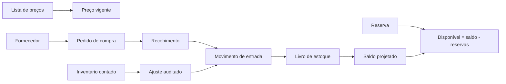

# Parecer técnico M06 — Preços, estoque e compras

## 1. Decisão

O M06 deve permanecer no mesmo banco e no mesmo código multiempresa. A separação entre clientes será feita por `tenant_id`, RLS, permissões e chaves estrangeiras compostas. Estoques serão separados também por estabelecimento e localização. Não haverá banco, tabela ou fork por cliente.

## 2. Fluxo operacional

## 3. Fronteiras

- tenant: fronteira obrigatória de segurança;
- estabelecimento: fronteira operacional e de propriedade do estoque;
- localização: depósito, loja, oficina, cozinha, trânsito, perda ou quarentena;
- item/variante: objeto movimentado em sua unidade de estoque;
- lote e série: rastreabilidade opcional por item;
- documento: pedido, recebimento, inventário ou origem futura de venda/OS.

## 4. Modelo físico proposto

| Domínio | Tabelas | Regra central |
|---|---|---|
| Preços | `erp_price_lists`, `erp_price_items`, `erp_promotions` | vigência sem alteração retroativa de documentos |
| Locais | `erp_stock_locations` | pertence a um estabelecimento do mesmo tenant |
| Rastreio | `erp_stock_lots`, `erp_stock_serials` | lote e série nunca atravessam tenant/item |
| Livro | `erp_stock_movements`, `erp_stock_movement_items` | postagem imutável; correção por contrapartida |
| Reservas | `erp_stock_reservations` | expiração/liberação sem editar o livro |
| Inventário | `erp_inventory_counts`, `erp_inventory_count_items` | diferença gera ajuste, não edição de saldo |
| Compras | `erp_purchase_orders`, `erp_purchase_order_items` | snapshot de item, unidade, quantidade e preço |
| Recebimento | `erp_goods_receipts`, `erp_goods_receipt_items` | postagem atômica e idempotente no livro |

## 5. Invariantes obrigatórias

1. saldo é `sum(quantity_delta)` apenas de movimentos postados;
2. movimento postado não pode ser editado ou excluído;
3. `tenant_id`, estabelecimento, localização, item, variante, lote e série devem pertencer ao mesmo contexto;
4. quantidade usa `numeric(19,6)` e dinheiro usa `numeric(19,4)`;
5. cada operação postável exige `idempotency_key` única por tenant;
6. recebimento parcial é permitido, mas nunca acima do pedido sem permissão explícita futura;
7. série movimenta quantidade unitária e não pode ocupar duas localizações simultaneamente;
8. estoque negativo é bloqueado por padrão e só poderá ser habilitado por configuração auditada;
9. reserva reduz disponibilidade, não saldo físico;
10. custo e preço histórico são snapshots e não acompanham alteração cadastral posterior.

## 6. Concorrência

A postagem deve ocorrer em RPC transacional com bloqueio determinístico por tenant/item/localização. A função valida idempotência, permissão, saldo disponível e rastreabilidade antes de inserir cabeçalho e itens. Repetição com a mesma chave retorna a operação existente; chave reutilizada com conteúdo diferente é recusada.

## 7. Segurança

- permissões separadas: `pricing.read/manage`, `stock.read/manage/count`, `purchasing.read/manage/receive`;
- `anon` sem acesso;
- `authenticated` com grants mínimos filtrados por RLS;
- ausência de `DELETE` para documentos e livro;
- criação/postagem por RPC; tenant sempre obtido e revalidado no servidor;
- consultas de saldo não usam tabela editável como fonte de verdade.

## 8. Cobertura multissegmento

| Segmento | Aplicação |
|---|---|
| Varejo/papelaria | preço por canal, depósitos, compras e inventário |
| Vestuário | estoque e preço por variante de cor/tamanho |
| Oficina | peças por depósito, lote/série opcional e recebimento |
| Restaurante | ingredientes fracionados, lote, validade e composição |
| Serviços | listas de preço; estoque e compras opcionais |

## 9. Sequência determinística

1. criar migration, preflight, rollback de laboratório e testes SQL;
2. implementar consultas e comandos server-side;
3. criar telas de preços, estoque e compras;
4. validar testes, type-check, lint e build;
5. executar dry-run remoto e solicitar autorização exclusiva para a migration.

## 10. Fora do M06

Vendas, PDV e caixa ficam no M07; contas a pagar e liquidações ficam no M08; consumo por OS no M09; baixa por receita/comanda no M10; regras fiscais no M13. O M06 fornece contratos de origem para esses módulos sem antecipar decisões fiscais.

## 11. Critério de aceite

O pacote será tecnicamente aceito quando comprovar isolamento cross-tenant, impossibilidade de editar livro postado, idempotência, recebimento parcial, bloqueio de saldo negativo, reservas concorrentes, lotes/séries consistentes e saldo derivado reconciliado.
