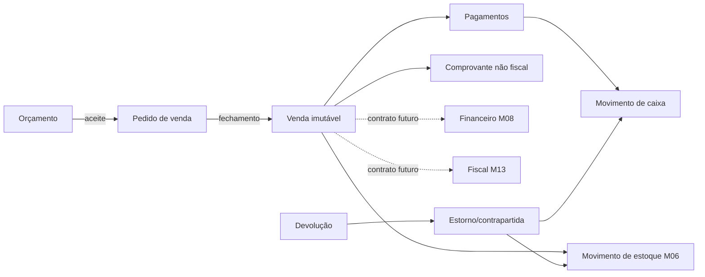

# Parecer técnico M07 — Orçamentos, vendas e PDV

## 1. Decisão

O M07 utilizará o mesmo núcleo multiempresa aprovado. Orçamentos, pedidos, vendas, pagamentos e caixas terão `tenant_id` obrigatório, RLS e chaves compostas. A empresa ativa será derivada da sessão no servidor; nenhum formulário poderá escolher ou alterar o tenant diretamente.

O fechamento de venda será uma operação transacional e idempotente. A venda somente será considerada concluída quando totais, pagamentos, estoque e caixa estiverem conciliados dentro da mesma transação.

## 2. Fluxo gráfico

## 3. Modelo físico proposto

| Domínio | Entidades | Responsabilidade |
|---|---|---|
| Orçamento | `erp_quotes`, `erp_quote_items` | proposta com validade, snapshots e versionamento |
| Pedido | `erp_sales_orders`, `erp_sales_order_items` | compromisso comercial e origem da venda |
| Venda | `erp_sales`, `erp_sale_items` | documento comercial imutável após fechamento |
| Devolução | `erp_returns`, `erp_return_items` | contrapartida rastreável de itens e valores |
| Pagamentos | `erp_payment_methods`, `erp_sale_payments` | dinheiro, PIX, cartão, vale e referência externa |
| Caixa | `erp_cash_registers`, `erp_cash_sessions`, `erp_cash_movements` | abertura, suprimento, sangria, recebimento e fechamento |
| Comprovante | `erp_sale_receipts` | número, conteúdo seguro, hash e reemissões auditáveis |

## 4. Estados

- orçamento: `draft → sent → accepted | rejected | expired | cancelled`;
- pedido: `draft → confirmed → partially_fulfilled → fulfilled | cancelled`;
- venda: `draft → completed → partially_returned | returned | voided`;
- pagamento: `pending → authorized → captured | failed | cancelled | refunded`;
- sessão de caixa: `open → closing → closed`, sem reabertura destrutiva;
- devolução: `draft → completed | cancelled`.

Transições serão validadas no banco/RPC. Atualização direta de estado por cliente não será autoridade suficiente.

## 5. Invariantes monetárias

1. quantidade usa `numeric(19,6)` e valores usam `numeric(19,4)`;
2. itens preservam snapshots de código, descrição, unidade, preço, desconto e total;
3. `subtotal - descontos + acréscimos = total` deve fechar por item e documento;
4. soma de pagamentos capturados não pode exceder o total sem troco explicitamente registrado;
5. troco somente é permitido em método configurado como dinheiro;
6. moeda é imutável após confirmação;
7. preço informado pelo navegador nunca é autoridade; o servidor resolve lista vigente e permissões de desconto;
8. arredondamento ocorre por linha e o ajuste deve ser explícito e auditável.

## 6. Estoque

- somente itens com `track_inventory=true` geram baixa;
- baixa usa o livro `erp_stock_movements` do M06 com tipo `sale`;
- indisponibilidade bloqueia fechamento, salvo configuração futura auditada de estoque negativo;
- reserva do pedido é consumida no fechamento ou liberada no cancelamento;
- devolução gera movimento de retorno/contrapartida, nunca altera a baixa original;
- lote, série, variante, localização e unidade permanecem no mesmo tenant/item.

## 7. Caixa e pagamentos

- cada terminal lógico pertence a um estabelecimento;
- uma sessão aberta pertence a um operador e caixa definidos;
- recebimento em dinheiro exige sessão aberta;
- suprimento, sangria, venda, devolução e ajuste são movimentos imutáveis;
- fechamento registra valor contado, valor esperado e diferença, sem sobrescrever movimentos;
- integrações externas armazenam provedor, ID externo, estado e idempotency key, nunca token secreto;
- as tabelas legadas `orders`, `order_items` e `payments` do site/Mercado Pago não serão reutilizadas pelo ERP.

## 8. Operação atômica

A futura RPC de fechamento deverá:

1. validar usuário, tenant, estabelecimento, caixa e idempotency key;
2. bloquear deterministicamente pedido/reservas/itens envolvidos;
3. recalcular preços, descontos, totais, troco e saldo disponível no servidor;
4. criar venda, itens, pagamentos, baixa de estoque e movimentos de caixa;
5. confirmar tudo ou reverter tudo, retornando a venda existente em repetição idempotente.

## 9. Segurança e permissões

- `sales.read`, `sales.quote`, `sales.order`, `sales.complete`, `sales.return`, `sales.discount`;
- `payments.read`, `payments.manage`, `payments.refund`;
- `cash.read`, `cash.operate`, `cash.close`, `cash.adjust`;
- `anon` sem acesso e `authenticated` limitado por RLS;
- documentos concluídos e movimentos não terão `UPDATE`/`DELETE` para usuários;
- cancelamento, devolução, desconto excepcional e ajuste exigirão motivo e auditoria;
- ações privilegiadas deverão respeitar MFA definido no M04.

## 10. Concorrência e idempotência

- chave única por tenant em fechamento, pagamento, webhook, devolução e movimento de caixa;
- locks em ordem estável por item/localização evitam deadlocks;
- dois fechamentos simultâneos do mesmo pedido não podem criar duas vendas;
- dois pagamentos com o mesmo ID do provedor não podem ser capturados duas vezes;
- fechamento de caixa deve usar snapshot consistente e impedir novos movimentos durante a transição final.

## 11. Limites do M07

- comprovante do M07 é não fiscal;
- emissão NF-e/NFC-e e regras tributárias ficam no M13;
- parcelas, contas a receber, liquidações e conciliação bancária ficam no M08;
- TEF, impressoras, gaveta, balança e modo offline ficam no M12;
- Mercado Pago ERP será apenas uma implementação futura do contrato de pagamento, isolada do checkout do site;
- nenhuma decisão fiscal, credencial de gateway ou conta real integra este módulo.

## 12. Cobertura multissegmento

| Segmento | Aplicação |
|---|---|
| Varejo/papelaria | orçamento opcional, venda rápida, PDV, estoque e caixa |
| Vestuário | venda por variante e devolução rastreada |
| Oficina | orçamento/pedido consumidos futuramente pela OS do M09 |
| Restaurante | venda base consumida futuramente por comandas do M10 |
| Serviços | orçamento, pedido e venda sem baixa de estoque |

## 13. Sequência determinística proposta

1. criar migration `0023`, preflight, rollback de laboratório e testes SQL;
2. implementar RPCs atômicas de sessão de caixa e fechamento de venda;
3. implementar serviços e telas de orçamento, vendas e PDV;
4. executar cenários de concorrência, idempotência e reconciliação;
5. validar dry-run e solicitar autorização exclusiva antes da aplicação remota.

## 14. Critérios de aceite

O M07 será aceito quando comprovar isolamento cross-tenant, fechamento atômico, totais determinísticos, preço server-side, baixa única de estoque, caixa reconciliado, idempotência, devolução por contrapartida, documentos concluídos imutáveis e ausência de dados reais.
