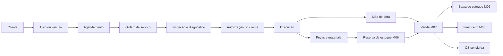

# Parecer técnico M09 — Serviços e oficinas

## 1. Decisão

O M09 atenderá oficinas, assistência técnica, manutenção de equipamentos e prestadores de serviço no mesmo núcleo multiempresa. A ordem de serviço será o dossiê operacional: registra cliente, ativo, sintomas, diagnóstico, autorização, execução, peças, mão de obra, medições, evidências e histórico.

O fechamento comercial não criará um segundo mecanismo de venda. A OS produzirá uma venda M07 idempotente; a venda fará a baixa M06 e poderá originar o financeiro M08. Essa composição evita estoque, caixa ou cobrança duplicados.

## 2. Fluxo gráfico

## 3. Modelo físico proposto

| Domínio | Entidades | Responsabilidade |
|---|---|---|
| Ativos | `erp_assets`, `erp_asset_identifiers`, `erp_asset_meter_readings` | equipamentos, máquinas, eletrônicos e histórico de medição |
| Veículos | `erp_vehicles`, `erp_vehicle_identifiers`, `erp_vehicle_meter_readings` | placa, chassi mascarável, modelo, ano e quilometragem |
| Agenda | `erp_appointments`, `erp_appointment_resources` | horário, cliente, técnico, box/equipamento e capacidade |
| OS | `erp_service_orders`, `erp_service_order_items` | cabeçalho, serviços, peças, materiais e snapshots |
| Workflow | `erp_service_order_events` | mudanças de estado e decisões imutáveis |
| Técnicos | `erp_service_assignments`, `erp_work_logs` | responsabilidade, tempo previsto e realizado |
| Inspeção | `erp_inspections`, `erp_inspection_items` | checklist, condição, observação e resultado |
| Evidências | `erp_service_attachments` | metadados e referência protegida para fotos/documentos |
| Autorizações | `erp_service_approvals` | aceite/recusa, escopo, canal, horário e evidência |
| Garantias | `erp_service_warranties`, `erp_warranty_events` | vigência, cobertura e ocorrências |

## 4. Ativo universal e veículo

`erp_assets` será a entidade base para qualquer objeto atendido: computador, impressora, máquina, aparelho, ferramenta ou equipamento. `erp_vehicles` será extensão especializada quando existirem placa, RENAVAM/chassi, marca, modelo, combustível e odômetro.

- um ativo pertence ao tenant e a uma parte/proprietário do mesmo tenant;
- placa, serial, patrimônio e chassi terão normalização e unicidade contextual;
- identificadores sensíveis serão exibidos de forma mascarada conforme permissão;
- troca de proprietário preserva o histórico da OS;
- medidores são eventos, não um campo sobrescrito silenciosamente;
- correção de medidor exige evento de correção e justificativa.

## 5. Estados da agenda e OS

- agendamento: `requested → confirmed → checked_in → completed | no_show | cancelled`;
- OS: `draft → awaiting_approval → approved → in_progress → quality_check → ready → completed`;
- saídas alternativas: `cancelled`, `on_hold` e `rejected`;
- item: `proposed → approved → in_progress → completed | rejected | cancelled`;
- garantia: `active → expired | voided`, com eventos imutáveis.

Transições serão comandadas por RPCs e registradas em `erp_service_order_events`. Nenhuma interface poderá alterar diretamente uma OS concluída.

## 6. Itens, peças e mão de obra

- item `service` representa serviço/mão de obra vendável;
- item `part`, `product` ou `supply` representa peça/material controlável;
- cada linha preserva código, descrição, unidade, quantidade, preço e desconto como snapshot;
- peças podem ser reservadas no M06 antes da execução;
- consumo definitivo ocorre uma única vez pela venda M07 no fechamento;
- mão de obra registra técnico, início, fim, pausas e duração, mas preço é resolvido no servidor;
- itens adicionais exigem nova autorização quando excederem o limite aprovado.

## 7. Inspeção, diagnóstico e autorização

- inspeções usam checklist versionado e preservam o resultado aplicado;
- diagnóstico diferencia relato do cliente, constatação técnica e recomendação;
- autorização registra escopo, valor, validade, canal e responsável;
- aprovação verbal deve registrar operador, horário e justificativa, sem fingir assinatura digital;
- links externos de aprovação serão temporários, de uso único e vinculados ao tenant/OS;
- recusa de item não remove a proposta; registra decisão e motivo.

## 8. Operação atômica de fechamento

A futura RPC `erp_complete_service_order` deverá:

1. validar usuário, tenant, estabelecimento, OS, técnico e idempotency key;
2. bloquear a OS e recusar estado, inspeção ou autorização pendentes;
3. recalcular itens autorizados, preços e descontos no servidor;
4. criar/reutilizar a venda M07 vinculada à OS;
5. concluir venda, estoque e caixa/financeiro ou reverter tudo;
6. registrar evento final e retornar a mesma venda em repetição idempotente.

## 9. Agenda e concorrência

- horários serão armazenados em UTC e exibidos no fuso do estabelecimento;
- recursos poderão ser técnico, box, elevador, bancada ou equipamento;
- intervalos do mesmo recurso não poderão se sobrepor quando confirmados;
- capacidade e jornada serão validadas no servidor;
- reagendamento cria evento e preserva horário anterior;
- locks determinísticos impedirão dois fechamentos ou duas reservas da mesma OS.

## 10. Segurança e privacidade

- `service.read`, `service.manage`, `service.approve`, `service.execute`, `service.complete`, `service.cancel`;
- `assets.read`, `assets.manage`, `vehicles.read`, `vehicles.manage`;
- `schedule.read`, `schedule.manage`, `inspection.manage`, `warranty.manage`;
- `anon` sem acesso; usuários limitados por tenant, membership e RLS;
- conclusão, cancelamento, autorização e garantia exigem evento auditável;
- fotos e documentos ficam em storage privado; banco guarda referência, hash, tamanho e tipo;
- URLs assinadas terão expiração curta e não serão persistidas em logs;
- dados pessoais, placa, chassi e contatos seguirão minimização e controle de acesso.

## 11. Concorrência e idempotência

- criação, transição, autorização, reserva, fechamento e garantia usam chaves únicas por tenant;
- mesma chave com conteúdo diferente será recusada;
- OS bloqueada em ordem estável antes de itens, reservas e venda;
- duas tentativas simultâneas não podem gerar duas vendas ou duas baixas;
- webhook/link de autorização repetido retorna a decisão já registrada;
- lançamento de tempo duplicado será bloqueado por técnico/intervalo/idempotência.

## 12. Garantia e retorno

- garantia referencia OS, itens cobertos, período e condições registradas;
- retorno em garantia cria nova OS vinculada à original;
- peça substituída, retrabalho e custo interno permanecem rastreáveis;
- garantia não altera a venda original;
- eventual estorno comercial usa devolução M07 e contrapartida M06/M08;
- regras legais/contratuais de garantia serão configuradas posteriormente e não presumidas pelo software.

## 13. Relatórios derivados

- agenda, ocupação e produtividade por técnico/recurso;
- OS por estado, prazo, cliente, ativo e tipo de serviço;
- horas previstas × realizadas;
- peças reservadas, consumidas e devolvidas;
- ticket médio e margem operacional estimada;
- reincidência, retorno e garantia;
- histórico completo do ativo/veículo;
- tempos de aprovação, execução e entrega.

## 14. Limites do M09

- não implementa mesas, comandas ou cozinha, que ficam no M10;
- não implementa periféricos, impressão ou modo offline, que ficam no M12;
- não decide tributação ou emissão fiscal, que ficam no M13;
- não armazena fotos públicas, assinatura criptográfica presumida ou documento real;
- integração com seguradoras, montadoras e tabelas externas exigirá contrato futuro;
- migração de OS legadas fica no M14.

## 15. Sequência determinística proposta

1. criar migration `0025`, preflight, rollback e testes SQL;
2. implementar RPCs de transição, autorização e fechamento de OS;
3. criar serviços e telas de agenda, ativos, veículos e OS;
4. testar sobreposição, idempotência, reserva, venda e reconciliação;
5. validar dry-run e solicitar autorização exclusiva antes da aplicação remota.

## 16. Critérios de aceite

O M09 será aceito quando comprovar isolamento cross-tenant, histórico imutável, agenda sem conflito, autorização rastreável, preço server-side, baixa única de peças, fechamento atômico com M07/M08, garantia por eventos, anexos privados e zero dados reais.
