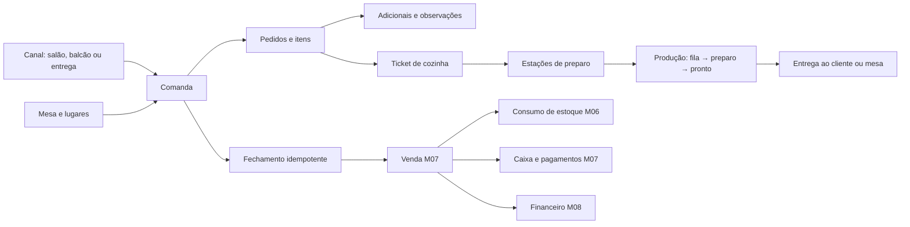

# Parecer técnico M10 — Restaurantes e lanchonetes

## 1. Decisão

O M10 será uma camada operacional de alimentação sobre os núcleos já validados. Produtos preparados, ingredientes, receitas e unidades permanecem no catálogo M05; disponibilidade e consumo ficam no estoque M06; a comanda gera uma única venda M07; caixa e financeiro continuam no M07/M08.

A comanda não será uma venda paralela. Ela organizará atendimento, mesa, pessoas, cursos de preparo, adicionais, cozinha, entrega e rateio. Somente seu fechamento idempotente criará ou reutilizará a venda M07, evitando cobrança, baixa de ingrediente ou movimento financeiro duplicado.

## 2. Fluxo gráfico

## 3. Modelo físico proposto

| Domínio | Entidades | Responsabilidade |
|---|---|---|
| Salão | `erp_dining_areas`, `erp_dining_tables` | áreas, mesas, capacidade, disponibilidade e QR lógico |
| Sessão de mesa | `erp_table_sessions`, `erp_table_session_events` | abertura, ocupação, transferência, junção e encerramento |
| Comandas | `erp_food_tabs`, `erp_food_tab_guests`, `erp_food_tab_events` | canal, cliente, pessoas, estado e histórico imutável |
| Pedidos | `erp_food_orders`, `erp_food_order_items` | rodadas, itens, quantidades, preço e snapshot comercial |
| Adicionais | `erp_modifier_groups`, `erp_modifiers`, `erp_food_order_item_modifiers` | escolhas obrigatórias/opcionais e preço adicional |
| Receitas | M05 `erp_item_compositions` e extensões `erp_recipe_yields` | ficha técnica, rendimento, perdas e versão aplicada |
| Cozinha | `erp_kitchen_stations`, `erp_kitchen_tickets`, `erp_kitchen_ticket_items` | roteamento, fila, preparo e expedição |
| Entrega/retirada | `erp_food_fulfillments` | retirada, entrega própria ou integração futura |
| Rateio | `erp_food_tab_splits` | divisão por pessoa, item ou valor antes da venda |

Todas as entidades terão `tenant_id`, chaves compostas por tenant, RLS e referências multiempresa consistentes.

## 4. Canais e comandas

- canais iniciais: `dine_in`, `counter`, `takeaway` e `delivery`;
- uma comanda pertence a um estabelecimento e pode ou não usar mesa;
- mesa aberta não implica venda criada;
- cliente identificado é opcional no atendimento rápido, respeitando regras fiscais futuras;
- quantidade de pessoas registra capacidade e rateio, sem criar identidades fictícias;
- códigos de comanda serão sequenciais por tenant/estabelecimento;
- canais de marketplace serão integrações futuras, nunca confiança direta em payload externo.

## 5. Estados e transições

- mesa: `available → occupied → cleaning → available`, com `blocked` opcional;
- sessão: `open → closing → closed | cancelled`;
- comanda: `open → ordering → ready_to_close → closed | cancelled`;
- pedido: `draft → sent → preparing → ready → served | cancelled`;
- item: `draft → queued → preparing → ready → served | cancelled | voided`;
- ticket: `queued → accepted → preparing → ready → dispatched | cancelled`.

Transições críticas ocorrerão por RPC e gerarão eventos. Item enviado à cozinha não será apagado: cancelamento ou correção exigirá contrapartida e justificativa.

## 6. Cardápio, receitas e rendimento

- o item vendável continuará em `erp_catalog_items`, com tipo `prepared`, `product` ou outro já permitido;
- a ficha técnica continuará em `erp_item_compositions` com `kind='recipe'`;
- cada receita terá versão, rendimento, unidade produzida e percentual de perda controlado;
- a comanda preservará a versão da receita e os componentes efetivamente considerados;
- substituições não alterarão silenciosamente a receita histórica;
- custo estimado será derivado dos componentes, sem ser gravado como verdade imutável;
- disponibilidade poderá considerar estoque, estação, horário e bloqueio manual auditado.

## 7. Adicionais e observações

- grupos definirão mínimo, máximo e obrigatoriedade, como tamanho, ponto, borda ou acompanhamento;
- adicional poderá acrescentar preço, ingrediente ou ambos;
- seleção repetida respeitará quantidade máxima configurada;
- observação livre não poderá alterar preço, ingrediente ou regra de produção;
- alergênicos e restrições serão informativos e configuráveis, sem promessa médica automática;
- preço final será recalculado no servidor usando lista M06, adicionais e autorizações.

## 8. Cozinha e expedição

- cada item será roteado para uma ou mais estações por configuração versionada;
- um ticket agrupará itens da mesma rodada e preservará a sequência de envio;
- tempo de fila, início, conclusão e expedição serão eventos auditáveis;
- reimpressão ou reenvio não criará novo item de cozinha;
- telas KDS não terão permissão comercial para alterar preço ou pagamento;
- prioridade manual exigirá permissão e justificativa;
- o agente de impressão e operação offline permanecem no M12.

## 9. Estoque e produção

- o envio à cozinha poderá reservar ingredientes, mas não efetivará baixa definitiva;
- o fechamento da venda M07 fará um único consumo conforme receita aplicada;
- cancelamento antes do preparo libera reserva; após preparo registra perda ou consumo justificado;
- produção antecipada poderá usar movimento M06 `production`, vinculando entrada do preparado e consumo dos componentes;
- falta de ingrediente será avaliada sob lock por localização/item/lote;
- estoque negativo seguirá exclusivamente a política do local M06;
- nenhuma baixa ocorrerá diretamente pela interface da cozinha.

## 10. Fechamento, rateio e pagamento

A futura RPC `erp_close_food_tab` deverá:

1. validar usuário, tenant, estabelecimento, comanda e chave idempotente;
2. bloquear comanda, sessão de mesa, pedidos e rateios em ordem determinística;
3. recusar item em preparo, total inconsistente ou cancelamento sem autorização;
4. recalcular preços, adicionais, descontos e receitas no servidor;
5. criar ou reutilizar uma única venda M07 e seus itens;
6. delegar pagamento, estoque, caixa e financeiro aos módulos existentes;
7. fechar comanda e mesa somente após sucesso integral.

Rateios são instruções comerciais anteriores à captura. A soma das partes deverá ser exatamente igual ao total da comanda; arredondamento residual será atribuído de forma determinística.

## 11. Concorrência e idempotência

- abertura, pedido, envio, cancelamento, transferência, rateio e fechamento terão chave única por tenant;
- duas aberturas simultâneas não poderão ocupar a mesma mesa;
- número de versão impedirá sobrescrever uma comanda alterada por outro terminal;
- locks usarão ordem tenant → estabelecimento → mesa/comanda → pedido → item;
- mesma chave com conteúdo diferente será recusada;
- repetição do fechamento retornará a mesma venda;
- webhooks futuros de delivery terão inbox, assinatura, deduplicação e replay controlado.

## 12. Segurança e isolamento

- permissões propostas: `food.read`, `food.manage`, `food.order`, `food.kitchen`, `food.cancel`, `food.discount`, `food.close`;
- `anon` não terá acesso às tabelas operacionais;
- garçom acessará comandas autorizadas do tenant, sem administração de catálogo ou caixa;
- cozinha verá somente informações necessárias ao preparo, sem dados financeiros ou documentos do cliente;
- cancelamento, desconto, cortesia, transferência e reabertura terão permissão específica e auditoria;
- RLS validará tenant em todas as leituras e escritas;
- QR de mesa futuro será token curto, rotacionável e sem expor IDs internos.

## 13. Relatórios derivados

- ocupação, giro e tempo médio por mesa;
- pedidos e ticket médio por canal, período e atendente;
- tempo de fila, preparo e expedição por estação;
- itens mais vendidos, adicionais e cancelamentos;
- consumo teórico × real, perdas e desvios;
- margem estimada por receita e canal;
- comandas abertas, divergentes ou reabertas;
- conciliação entre comandas, vendas, pagamentos, estoque e financeiro.

## 14. Limites do M10

- não implementa emissão fiscal ou regras tributárias, reservadas ao M13;
- não implementa TEF, impressoras, balanças ou offline, reservados ao M12;
- não presume integração com iFood, Rappi ou outro marketplace sem contrato e credenciais futuras;
- não armazena dados reais de clientes ou cartões;
- não promete controle sanitário, nutricional ou de alergênicos sem validação especializada;
- migração de cardápios e comandas legadas permanece no M14.

## 15. Sequência determinística proposta

1. criar migration `0026`, preflight, rollback e testes SQL;
2. implementar RPCs de mesa, pedido, cozinha, cancelamento e fechamento;
3. criar serviços e telas de salão, comandas, cozinha e cardápio operacional;
4. testar concorrência, rateio, receita, estoque, venda e reconciliação;
5. validar localmente e parar antes de qualquer aplicação remota da `0026`.

## 16. Critérios de aceite

O M10 será aceito quando comprovar isolamento cross-tenant, mesa sem dupla ocupação, comanda versionada, cozinha sem acesso financeiro, adicionais validados, receita rastreável, cancelamento por contrapartida, rateio exato, fechamento idempotente, uma única venda/baixa de estoque e zero dados reais.
