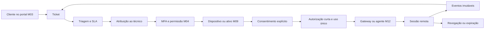

# Parecer técnico M11 — Atendimento e acesso remoto

## 1. Decisão

O M11 unificará central de atendimento, tickets, filas, SLA, dispositivos autorizados, consentimentos e trilha de sessões remotas. O ticket será o dossiê do atendimento; uma sessão remota sempre dependerá de ticket ativo, técnico autorizado, dispositivo do mesmo tenant, MFA válido e consentimento explícito dentro da validade.

A plataforma não implementará um protocolo proprietário de controle remoto dentro do banco. O Supabase guardará autorização, estado e auditoria; o transporte de tela/teclado será realizado por um provedor ou agente futuro com credenciais efêmeras e escopo mínimo. O M12 tratará o agente local e a comunicação com o dispositivo.

## 2. Fluxo gráfico

## 3. Modelo físico proposto

| Domínio | Entidades | Responsabilidade |
|---|---|---|
| Atendimento | `erp_support_tickets`, `erp_support_ticket_events` | assunto, descrição, prioridade, estado e histórico |
| Filas | `erp_support_queues`, `erp_support_queue_members` | equipes, horários e técnicos habilitados |
| SLA | `erp_sla_policies`, `erp_sla_targets`, `erp_ticket_sla_clocks` | resposta, solução, pausas e violações |
| Interações | `erp_support_messages`, `erp_support_attachments` | comunicação e referências privadas de anexos |
| Atribuição | `erp_ticket_assignments` | técnico atual e histórico de responsabilidade |
| Dispositivos | `erp_managed_devices`, `erp_device_identifiers` | vínculo com ativo M09, postura e identificação mascarada |
| Consentimento | `erp_remote_consents` | finalidade, escopo, pessoa, canal, emissão, validade e revogação |
| Autorizações | `erp_remote_access_grants` | token com hash, técnico, dispositivo, escopo e uso único |
| Sessões | `erp_remote_sessions`, `erp_remote_session_events` | início, fim, resultado e eventos append-only |
| Evidências | `erp_remote_session_artifacts` | referência privada para logs ou gravações consentidas |

Todas as referências funcionais serão compostas por `tenant_id`; nenhum identificador vindo do cliente decidirá sozinho o tenant.

## 4. Tickets e estados

- ticket: `new → triaged → assigned → in_progress → waiting_customer | waiting_internal → resolved → closed`;
- saídas controladas: `cancelled`, `reopened` e `merged`;
- prioridade: `low`, `normal`, `high`, `urgent`;
- origem: portal, plataforma, e-mail validado, telefone registrado ou integração futura;
- reabertura preserva resolução anterior e cria evento;
- merge não apaga ticket; vincula o secundário ao principal;
- mudança de prioridade, fila, técnico ou SLA exige evento auditável.

## 5. SLA e calendário

- políticas serão versionadas por tenant, serviço, prioridade e contrato;
- relógios considerarão calendário, fuso e feriados configurados;
- estados de espera poderão pausar apenas metas expressamente configuradas;
- primeira resposta e resolução terão relógios separados;
- alteração de política não reescreverá o SLA já aplicado ao ticket;
- violações serão derivadas de eventos e deadlines persistidos;
- notificações futuras não serão consideradas prova única de cumprimento.

## 6. Filas e atribuição

- uma fila pertence ao tenant e pode restringir estabelecimento, capacidade ou especialidade;
- membership ativa no tenant é obrigatória para participar da fila;
- atribuição manual exige `support.assign`; automática será determinística e auditada;
- técnico suspenso, revogado ou fora do tenant não poderá receber ticket;
- redistribuição preservará histórico, motivo e ator;
- visão da fila respeitará escopo do técnico e não exporá outros tenants;
- equipe da plataforma terá acesso cross-tenant somente por papel privilegiado, motivo e auditoria.

## 7. Dispositivos gerenciados

- dispositivo poderá referenciar `erp_assets` do M09, sem duplicar cliente ou patrimônio;
- identificadores serão normalizados, minimizados e mascarados na interface;
- vínculo inicial exigirá código de pareamento curto, uso único e expiração;
- chave privada do agente nunca será armazenada em tabela ou navegador;
- postura registrará versão, última atividade e capacidades, sem inventário invasivo por padrão;
- dispositivo revogado não poderá receber novo grant;
- transferência de proprietário exigirá novo vínculo e invalidará autorizações anteriores.

## 8. Consentimento explícito

- consentimento será específico para ticket, dispositivo, técnico ou fila, finalidade e escopo;
- padrão será acesso assistido; acesso não assistido permanecerá desabilitado;
- validade será curta e nunca renovada silenciosamente;
- canal, ator, data, texto/versionamento e evidência serão registrados;
- revogação será imediata e impedirá novas conexões ou reconexões;
- consentimento recusado ou expirado não será convertido em aceite por operador;
- contrato de suporte não substituirá aviso e consentimento da sessão quando exigidos.

## 9. Grant e token efêmero

A futura RPC `erp_issue_remote_access_grant` deverá:

1. validar usuário, MFA recente, membership, permissão, ticket, atribuição e tenant;
2. validar dispositivo ativo, consentimento vigente e escopo compatível;
3. bloquear ticket, consentimento e dispositivo em ordem determinística;
4. gerar material aleatório somente no servidor e armazenar apenas o hash;
5. emitir grant de uso único, com expiração curta e audience do gateway;
6. registrar evento sem segredo, token, captura de tela ou credencial;
7. retornar o segredo uma única vez ao canal server-to-server autorizado.

Uma repetição idempotente retornará o mesmo identificador de grant, mas nunca reexibirá segredo já consumido.

## 10. Sessões e revogação

- sessão: `requested → authorized → connecting → active → ended | denied | failed | revoked | expired`;
- somente o gateway autenticado poderá confirmar conexão e término;
- heartbeat atualizará presença sem ampliar validade ou escopo;
- expiração, logout, revogação de membership, encerramento do ticket ou do consentimento cortarão a sessão;
- reconexão exigirá grant novo quando o anterior tiver sido consumido;
- duração máxima será definida no servidor;
- encerramento forçado registrará ator, motivo e horário.

## 11. Auditoria e privacidade

- eventos registrarão tenant, ticket, sessão, ator, dispositivo, ação, horário, IP truncado quando necessário e resultado;
- logs nunca conterão token, senha, conteúdo de clipboard, chave privada ou dado digitado;
- gravação de tela ficará desabilitada por padrão e exigirá consentimento específico;
- artefatos ficarão em storage privado, criptografado pelo provedor e com retenção configurável;
- URLs assinadas serão curtas e não persistidas;
- download de artefato será auditado;
- retenção e descarte seguirão necessidade contratual e LGPD, com legal hold explícito quando aplicável.

## 12. Segurança e isolamento

- permissões propostas: `support.read`, `support.create`, `support.manage`, `support.assign`, `support.sla`, `remote.request`, `remote.connect`, `remote.revoke`, `remote.audit`;
- `anon` não acessará tabelas operacionais;
- RLS exigirá tenant e membership ativa em todas as consultas de cliente;
- técnico verá somente tickets atribuídos ou filas autorizadas;
- emissão de grant será `security definer`, com `search_path` fixo e sem execução para `anon`;
- MFA recente será obrigatório para `remote.connect` e `remote.audit` privilegiado;
- service role ficará restrita ao backend/gateway, nunca ao agente, portal ou navegador;
- rate limit bloqueará enumeração, brute force de pareamento e emissão abusiva de grants.

## 13. Concorrência e idempotência

- criação, mensagens, atribuição, consentimento, grant, sessão, heartbeat e revogação terão chaves únicas por tenant;
- mesma chave com conteúdo diferente será recusada;
- somente um grant ativo por ticket/dispositivo/técnico será permitido quando configurado;
- locks seguirão tenant → ticket → dispositivo → consentimento → grant;
- dois técnicos não poderão assumir exclusividade simultaneamente;
- consumo do token será atômico e comparará hash, audience, validade e estado;
- eventos externos usarão inbox deduplicada e assinatura verificada.

## 14. Limites do M11

- não implementa driver, serviço Windows, túnel, captura de tela ou controle de periféricos, reservados ao M12;
- não escolhe ainda fornecedor de acesso remoto ou protocolo de transporte;
- não permite acesso oculto, persistência silenciosa ou bypass de consentimento;
- não armazena senhas do cliente, credenciais de sistema ou segredo do agente;
- não cria gravações ou dados reais;
- integrações com e-mail, WhatsApp ou telefonia exigirão contratos e webhooks futuros;
- migração de tickets legados permanece no M14.

## 15. Sequência determinística proposta

1. criar migration `0027`, preflight, rollback e testes SQL;
2. implementar RPCs de ticket, atribuição, consentimento, grant, consumo e revogação;
3. criar serviços e telas de central, filas, SLA, dispositivos e sessões;
4. testar cross-tenant, MFA, expiração, uso único, revogação e auditoria;
5. validar localmente e parar antes de qualquer aplicação remota da `0027`.

## 16. Critérios de aceite

O M11 será aceito quando comprovar isolamento cross-tenant, ticket e SLA rastreáveis, técnico autorizado, dispositivo vinculado, MFA recente, consentimento explícito, grant com hash/uso único/expiração, revogação imediata, eventos imutáveis, artefatos privados, nenhum segredo em banco/log/browser e zero dados reais.
